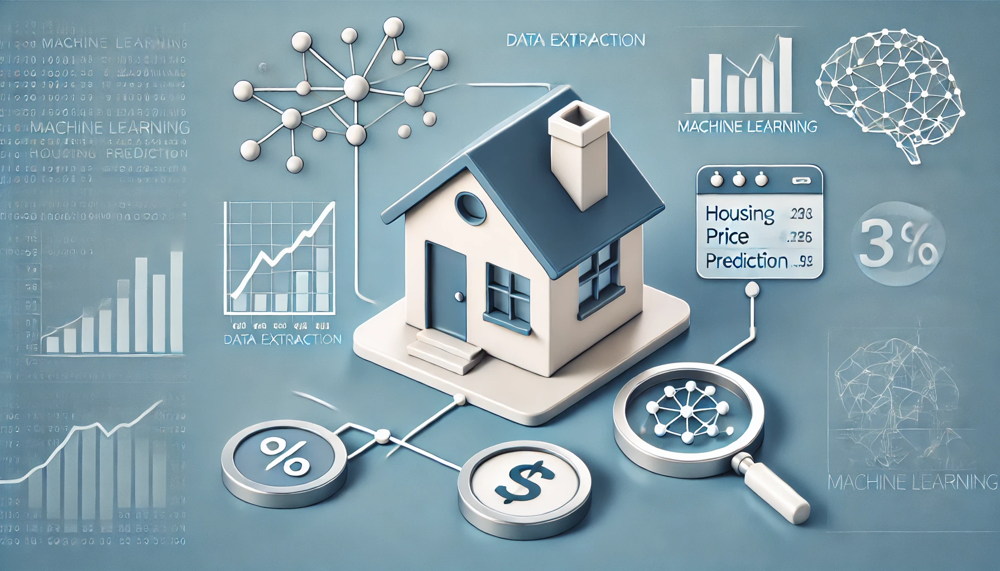

# python-for-ds-project



## 1. Giới thiệu về dự án

Phát triển phần mềm có thể tự động thu thập dữ liệu về nhà đất trên trang web bất động sản lớn của Việt Nam https://batdongsan.vn/ (chủ yếu là nhà ở khu vực thành phố Hồ Chí Minh). Sau đó tiến hành đi sâu vào phân tích dữ liệu, tìm kiếm các mối quan hệ ảnh hưởng cao đến giá cả nhà đất. Cuối cùng huấn luyện một mô hình học máy giúp nhận vào các giá trị đặc trưng cần thiết và xuất ra được giá dự đoán của căn nhà.

**CÁC THÀNH VIÊN TRONG DỰ ÁN**


<p align="center">
  <table>
    <tr>
      <th>MSSV</th>
      <th>Tên</th>
    </tr>
    <tr>
      <td>22110063</td>
      <td>Hồ Quốc Nhân Hòa</td>
    </tr>
    <tr>
      <td>22110195</td>
      <td>Đào Xuân Tân</td>
    </tr>
    <tr>
      <td>22110202</td>
      <td>Lý Quang Thắng</td>
    </tr>
    <tr>
      <td>22110245</td>
      <td>Lê Phú Trường</td>
    </tr>
    <tr>
      <td>22110263</td>
      <td>Trần Lê Hữu Vinh</td>
    </tr>
  </table>
</p>

**TRƯỜNG ĐẠI HỌC KHOA HỌC TỰ NHIÊN - ĐHQG Hồ Chí Minh**


## 2. Các framework sử dụng

Toàn bộ dự án đều được lập trình bằng ngôn ngữ Python.

- Về cào dữ liệu trên web, dự án sử dụng cả 2 công cụ độc lập *Requests* và *Selenium* kết hợp với *BeautifulSoup* để lấy được dữ liệu về và lưu trữ dưới dạng `.csv`
- Sử dụng thư viện *Scikit Learn* để sử dụng các thuật toán học máy.

## 3. Cách cài đặt dự án

1. Đầu tiên cần cài đặt các thư viện cần thiết và phiên bản Python khuyến nghị là 3.10.x

    ```python
    pip install -r requirements.txt
    ```

2. Dữ liệu thô đã được cung cấp sẵn trong [data/raw_data.csv](data/raw_data.csv). Bạn có thể thử cào lại dữ liệu bằng cách chạy file [crawling_request.py](DataCrawling&Preprocessing/crawling_request.py) bằng câu lệnh

    ```python
    python DataCrawling&Preprocessing/crawling_request.py
    ```

3. Sau khi có được dữ liệu thô, bạn hãy dùng file [transform.py](DataCrawling&Preprocessing/transform.py) để làm sạch dữ liệu, chuẩn bị cho quá trình phân tích dữ liệu và features engineering.
    ```python
    python DataCrawling&Preprocessing/transform.py
    ```

4. Cuối cùng chuẩn hóa dữ liệu thông qua quá trình EDA và Features Engineering.
    ```python
    python EDA & Feature Engineering/HousingPipeline.py
    ```

    Từ đó bạn đã có dữ liệu đủ tiêu chuẩn để tiến vào huấn luyện mô hình.

5. Về huấn luyện mô hình, bạn đọc chi tiết hơn trong [README.md](train/README.md) của thư mục train.

## 4. Kết luận lại và mục tiêu trong tương lai

Kết luận và đánh giá mô hình, bạn có thể xem chi tiết trong [báo cáo đồ án môn học](Report.md) hoặc bất kỳ định dạng bạn có thể đọc. 

Trong tương lai: 
- Chúng tôi cố gắng cải tiến tốc độ cào dữ liệu, bảo mật, tránh bị quét bởi các công cụ nhận diện sự cào dữ liệu. 
- Sử dụng các tool về bản đồ tốt hơn để trích xuất tốt được thông tin vị trí của nhà ở. 
- Huấn luyện mô hình mạnh hơn để có thể khai thác được nhiều khía cạnh của dữ liệu hơn nhằm tăng sự chính xác cho giá nhà được dự đoán ra.


