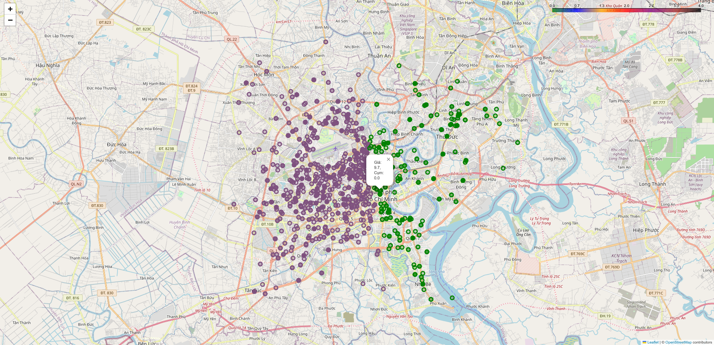

# Table of contents

- [Table of contents](#table-of-contents)
- [I. Data Crawling and Preprocessing](#i-data-crawling-and-preprocessing)
  - [Thu thập dữ liệu](#thu-thập-dữ-liệu)
    - [Mục tiêu](#mục-tiêu)
    - [Quy trình thu thập dữ liệu](#quy-trình-thu-thập-dữ-liệu)
      - [Cách script hoạt động](#cách-script-hoạt-động)
  - [Chuyển đổi dữ liệu](#chuyển-đổi-dữ-liệu)
    - [Mục tiêu](#mục-tiêu-1)
    - [Xử lý định dạng của Data Frame](#xử-lý-định-dạng-của-data-frame)
    - [Trích xuất dữ liệu từ cột `Description` và `Title`](#trích-xuất-dữ-liệu-từ-cột-description-và-title)
      - [Tổng quan, ý tưởng](#tổng-quan-ý-tưởng)
      - [Xử lý các dữ liệu số](#xử-lý-các-dữ-liệu-số)
      - [Tạo ra các cột dữ liệu mới hữu ích cho bài toán](#tạo-ra-các-cột-dữ-liệu-mới-hữu-ích-cho-bài-toán)
- [II. EDA và Feature Engineering](#ii-eda-và-feature-engineering)
  - [1. Khai báo thư viện và thiết lập](#1-khai-báo-thư-viện-và-thiết-lập)
  - [2. Rút ra thông tin từ dữ liệu](#2-rút-ra-thông-tin-từ-dữ-liệu)
    - [2.1. Tổng quan về dữ liệu](#21-tổng-quan-về-dữ-liệu)
    - [2.2. Phân tích phân phối các biến định lượng](#22-phân-tích-phân-phối-các-biến-định-lượng)
    - [2.3. Tình trạng dữ liệu thiếu:](#23-tình-trạng-dữ-liệu-thiếu)
    - [2.4. Phân tích theo thời gian](#24-phân-tích-theo-thời-gian)
    - [2.5. Các phát hiện chính](#25-các-phát-hiện-chính)
  - [3. Xử lý và làm sạch dữ liệu với `DataProcessing.py`](#3-xử-lý-và-làm-sạch-dữ-liệu-với-dataprocessingpy)
    - [3.1. Khai báo thư viện](#31-khai-báo-thư-viện)
    - [3.2. `DataCleaner` class](#32-datacleaner-class)
      - [3.2.1. Chức năng chính của `DataCleaner`](#321-chức-năng-chính-của-datacleaner)
      - [3.2.2. Các phương thức chính của `DataCleaner`](#322-các-phương-thức-chính-của-datacleaner)
    - [3.3. Các hàm khác](#33-các-hàm-khác)
    - [3.4. Chạy chương trình](#34-chạy-chương-trình)
  - [4. Xử lý, trực quan hóa dữ liệu và Feature Engineering với `Visualize.py`](#4-xử-lý-trực-quan-hóa-dữ-liệu-và-feature-engineering-với-visualizepy)
    - [4.1. Khai báo thư viện](#41-khai-báo-thư-viện)
    - [4.2. Lọc tọa độ theo lãnh thổ Việt Nam với hàm `check_coordinates_in_vietnam`](#42-lọc-tọa-độ-theo-lãnh-thổ-việt-nam-với-hàm-check_coordinates_in_vietnam)
      - [4.2.1. Tham số đầu vào](#421-tham-số-đầu-vào)
      - [4.2.2. Các bước xử lý chính trong hàm](#422-các-bước-xử-lý-chính-trong-hàm)
    - [4.3. Tạo bản đồ phân phối giá bất động sản với hàm `visualize_real_estate_price`](#43-tạo-bản-đồ-phân-phối-giá-bất-động-sản-với-hàm-visualize_real_estate_price)
      - [4.3.1. `RealEstateVisualizerPrice` class](#431-realestatevisualizerprice-class)
      - [4.3.2. Hàm `visualize_real_estate_price`](#432-hàm-visualize_real_estate_price)
    - [4.4. Tạo bản đồ phân cụm và Feature Engineering với hàm `visualize_real_estate_clusters`](#44-tạo-bản-đồ-phân-cụm-và-feature-engineering-với-hàm-visualize_real_estate_clusters)
      - [4.4.1. `RealEstateVisualizerClusters` class](#441-realestatevisualizerclusters-class)
      - [4.4.2. Hàm `visualize_real_estate_clusters`](#442-hàm-visualize_real_estate_clusters)
    - [4.5. Tạo bản đồ Heatmap dựa trên giá bất động sản với hàm `visualize_real_estate_price_heatmap`](#45-tạo-bản-đồ-heatmap-dựa-trên-giá-bất-động-sản-với-hàm-visualize_real_estate_price_heatmap)
      - [4.5.1. `RealEstateVisualizerHeatmap` class](#451-realestatevisualizerheatmap-class)
      - [4.5.2. Hàm `visualize_real_estate_price_heatmap`](#452-hàm-visualize_real_estate_price_heatmap)
    - [4.6. Chạy chương trình](#46-chạy-chương-trình)
  - [5. Feature Selection với `FeatureSelection.py`](#5-feature-selection-với-featureselectionpy)
    - [5.1. Khai báo thư viện](#51-khai-báo-thư-viện)
    - [5.2. `FeatureSelector` class](#52-featureselector-class)
    - [5.3. Phương pháp Variance Threshold](#53-phương-pháp-variance-threshold)
    - [5.4. Phương pháp Select K Best](#54-phương-pháp-select-k-best)
    - [5.5. Phương pháp Mutual Information](#55-phương-pháp-mutual-information)
    - [5.6. Phương pháp GridSearchCV](#56-phương-pháp-gridsearchcv)
    - [5.7. Phương pháp RandomizedSearchCV](#57-phương-pháp-randomizedsearchcv)
    - [5.8. Chạy chương trình](#58-chạy-chương-trình)
      - [5.8.1. Variance Threshold](#581-variance-threshold)
      - [5.8.2. Select K Best](#582-select-k-best)
      - [5.8.3. Mutual Information](#583-mutual-information)
      - [5.8.4. GridSearchCV](#584-gridsearchcv)
      - [5.8.5. RandomizedSearchCV](#585-randomizedsearchcv)
  - [6. Tách tập dữ liệu](#6-tách-tập-dữ-liệu)
  - [7. Xây dựng pipeline với `HousingPipeline.py`](#7-xây-dựng-pipeline-với-housingpipelinepy)
- [IV. Model Training](#iv-model-training)
- [V. Model Evaluation](#v-model-evalution)

# I. Data Crawling and Preprocessing

## Thu thập dữ liệu

### Mục tiêu
Thu thập dữ liệu cần thiết phục vụ cho bài toán từ trang web https://batdongsan.vn. Tuy nhiên bài toán đặt ra chỉ thu thập dữ liệu các bài đăng bất động sản trong khu vực thành phố Hồ Chí Minh nên nhóm thực hiện thay đổi đường dẫn để thu thập dư liệu thành https://batdongsan.vn/filter?options=on&gia_tri_tinh_chon=1&priceMin=0&priceMax=400&areaMin=0&areaMax=500& - chỉ bao gồm các bất động sản:

- Thuộc khu vực thành phố Hồ Chí Minh
- Mức giá từ 0 triệu đến 40 tỷ
- Diện tích từ 0 đến 500m2

Kết quả của quá trình thu thập dữ liệu sẽ là một file csv trong đó chứa thông tin của các bất động sản bao gồm:
- Date: Ngày đăng tin
- Type: Loại tin
- ID: Mã bài đăng
- Title: Tiêu đề bài đăng
- Location1: Địa chỉ 1 - Quận, Thành Phố
- Location2: Địa chỉ 2 - tên đường, phường... (nằm trong chi tiết bài đăng)
- Description: Mô tả về bất động sản
- Area: Diện tích
- Bedrooms: Số phòng ngủ
- Legal: Pháp lý
- WC: Số phòng vệ sinh
- House orientation: Hướng nhà
- Furniture: Tình trạng nội thất
- Price: Mức giá (Biến mục tiêu)

Yêu cầu của đầu ra:
- Chứa đầy đủ những thông tin cần thiết.
- Dữ liệu được làm sạch phần nào, dễ đọc, và chính xác.
- Tốc độ thu thập dữ liệu phải nhanh, ít tốn tài nguyên.

### Quy trình thu thập dữ liệu
Truy cập vào đường dẫn được cung cấp $\to$ Lấy ra đường dẫn dẫn đến chi tiết của các bài post, đồng thời là Location 1 (thông tin về quận của bất động sản, trong chi tiết bài post sẽ không có) $\to$ Duyệt qua các đường dẫn đã thu thập được, trích xuất thông tin chi tiết từ các bài đăng $\to$ Tổng hợp, chuẩn hóa và xuất ra file csv.

Quy trình trích xuất thông tin sử dụng một số công cụ quen thuộc trong việc crawl data như: `requests`, `BeautifulSoup`, `regex`.

Tuy nhiên việc thu thập từng trang như vậy chưa thực sự tối ưu về mặt thời gian, nên nhóm quyết định chạy script trên 10 luồng cùng một lúc bằng thư viện `ThreadPoolExecutor`.

#### Cách script hoạt động

```python
def get_data(start_page):
    """
    Crawl data from the website starting from the given page.

    Args:
        start_page (int): The starting page number.

    Returns:
        DataFrame: A DataFrame containing the crawled data from a specific page.
    """
    # Define the structure of the DataFrame
    # Location 1 is taken from the main page post interface, Location 2 is taken from the detailed post
    report = pd.DataFrame(columns=['Date', 'Type', 'ID', 'Title', 'Location1', 'Location2', 'Description', 'Area', 'Bedrooms', 'Legal', 'WC', 'House orientation', 'Furniture', 'Price'])

    # Perform data crawling from start_page to start_page + n_iter
    for i in range(start_page, start_page + n_iter):
        print(f"------Start crawl page {i}------")
        # Get basic information of 25 posts on the interface of page i
        try:
            response = requests.get(f"{url}page={i}")
            response.raise_for_status()
            soup = BeautifulSoup(response.text, 'html.parser')
            # Select the elements containing the links to the posts
            elements = soup.select('#danhmuc > div:nth-of-type(2) > div:nth-of-type(1) > div:nth-of-type(2) > a')
            # Extract and clean the location1 information from the selected elements (location 1 includes district and city names)
            location1 = [item.text.replace('\n', '').strip() for item in soup.select('.card-content .description')]
            location1 = [' '.join(item.split()) for item in location1]
        except requests.RequestException as e:
            print(f"Error fetching page {i}: {e}")
            continue
        # Extract the links of the posts from elements
        links = [element['href'] for element in elements]
        n = len(links)
        data = []
        # Crawl data from each post
        for j in range(n):
            try:
                post_response = requests.get(links[j])
                post_response.raise_for_status()
                post_soup = BeautifulSoup(post_response.text, 'html.parser')
                # Extract the title
                title = post_soup.select_one('h1').text
                # Extract the location 2 (street name, ward)
                location2 = post_soup.select_one('.footer').text.strip().split('\n')[0]
                # Extract the description of the post
                description = post_soup.select_one('#more1').text.strip()
                # Extract the params (Area, Bedroom, Legal, WC, House orientation, Furniture, Price) of the post
                params = get_params(post_soup.select_one('.box-characteristics').text)
                # Extract the post information (Date, Type, ID)
                post_info = [item.text.strip() for item in post_soup.select('.row.mat-42 .box-text .col .value')]
                # Concatenate all extracted information into a single list
                tmp = post_info + [title, location1[j], location2, description] + params
                print(f"\tCrawled post {j+1}/{n} on page {i}")
            except requests.RequestException as e:
                print(f"Error fetching post {links[j]}: {e}")
                continue
            except Exception as e:
                print(f"Error extracting data from post {links[j]}: {e}")
                continue
            # Append the extracted information to the data list
            data.append(tmp)
        # If data is not empty, convert it to a DataFrame and save it to a CSV file
        if data:
            # Convert list data of a page to a DataFrame and save it to a CSV file
            matrix_data = np.vstack([item for item in data])
            data_page = pd.DataFrame(matrix_data, columns=report.columns)
            data_page.to_csv(f'data/page{i}.csv', sep="\t", index=False)
            # Concatenate the data of the page to the report
            report = pd.concat([report, data_page], axis=0)
            report.set_index(np.arange(len(report)), inplace=True)
            print(f"------Page{i} - Done!------\n\n")

    return report
```

Về cơ bản đoạn script bên trên sẽ được sử dụng để thu thấp dữ liệu của `n_iter` trang, với trang bắt đầu crawl là `start_page`.

Giao diện của một trang sẽ như sau:


Trong một trang như vậy, script sẽ trích xuất hai đối tượng:
- `elements` các box của post $\to$ từ đây ta có thể lấy được đường dẫn đến các bài đăng.
- `location1` - địa chỉ chung của bài bất động sản (quận, thành phố), thông tin này chỉ được cung cấp ở giao diện page, không xuất hiện trong giao diện chi tiết bài đăng.

Sau khi đó được link của những bài post xuất hiện trong trang, ta sẽ tiến hành trích xuất dữ liệu như: `Date, Type, ID, Title, Location2, Description, Area, Bedrooms, Legal, WC, House orientation, Furniture, Price` các bài đăng chi tiết:


Riêng với dữ liệu được lưu trong trong element `box-characteristics` (html) thì sau khi đưa về dạng text, nhóm thiết kế thêm một bộ lọc để trích xuất các thông tin cần thiết về thông số của căn nhà trong đoạn text này (element này ở các bài post khác nhau có thể khác nhau, có bài có Hướng nhà, Hướng ban công, có bài thậm chí còn không có Số phòng ngủ, WC). Việc trích xuất các thông tin từ đoạn text do hàm `get_params` đảm nhận.

```python
def get_params(text):
    """
    Extract parameters from the given text using regular expressions.

    Args:
        text (str): The text to extract parameters from.

    Returns:
        list: A list of extracted parameters (Area, Bedroom, Legal, WC, House orientation, Furniture, Price).
    """
    # Regular expressions pattern for extracting parameters
    reg_pattern = {
        "Area": "Diện tích\s+(\d+)",
        "Bedroom": "Số phòng ngủ\s+(\d+)",
        "Legal": "Pháp lý\s+([^\n]+)",
        'WC': "Số toilet\s+(\d+)",
        'House orientation': "Hướng nhà\n+\s+(.+)",
        "Furniture": "Nội thất\n+\s+(.+)",
        "Price": "Mức giá\n+\s+(.+)"
    }
    # Perform the search for information according to the given pattern, if not found, return np.nan
    params = []
    for name in reg_pattern:
        try:
            params.append(re.search(r"{}".format(reg_pattern[name]), text).group(1))
        except:
            params.append(np.nan)
    return params
```
`get_params` nhận vào một đoạn text sau đó sử dụng `regex` để trích xuất thông tin cần thiết: `Area, Bedroom, Legal, WC, House orientation, Furniture, Price`. Nếu thông tin nào bị khuyết thì điền bằng `nan`.

Sau khi đã hoàn tất tất cả các qui trình trên thì script sẽ chuyển data thu thập được trong một trang thành DataFrame, lưu lại dưới dạng `page*.csv`. Sau đó gộp vào DataFrame `report` - chứa dữ liệu cuối cùng cho quá trình cào.

Tuy nhiên như đã đề cập ở trên, việc cào từng trang như vậy vẫn chưa thực sự tối ưu về mặt thời gian. Nên ta sử dụng đa luồng để giải quyết vấn đề này


```python
# Create a ThreadPoolExecutor with 10 threads to crawl data faster
    with ThreadPoolExecutor(max_workers=10) as executor:
        # Submit tasks to the executor
        futures = [executor.submit(get_data, start_page) for start_page in num_pages]
        # Collect results from the futures
        list_report = [future.result() for future in futures]

```

Đoạn code trên tạo một `ThreadPoolExecutor` với 10 luồng. Sau đó, gửi các tác vụ thu thập dữ liệu `get_data` cho từng trang bắt đầu trong `num_pages` đến nhóm luồng này. Mỗi tác vụ được gửi dưới dạng một future. Cuối cùng, nó thu thập kết quả từ các future này và lưu trữ chúng trong danh sách list_report.

Nhóm tiền hành crawl data trên 500 trang trên 10 luồng thì `num_pages` (list lưu `start_page` cho từng luồng) và `num_iter` (quy định số trang mà mỗi luồng sẽ cào) sẽ được set như sau:

```python
# List of starting pages for each thread
num_pages = [1,51,101,151,201,251,301,351,401,451]
# Number of iterations (pages) to crawl per thread
n_iter = 50
```

Sau đó script thực hiện concat tất cả DataFrame trong `list__report` và lưu lại dưới dạng file csv
```python
    # Concatenate all results into a single DataFrame
    df = pd.concat(list_report, axis=0)
    # Save the final DataFrame to a CSV file
    df.to_csv('raw_data.csv', sep='\t')
```

## Chuyển đổi dữ liệu

### Mục tiêu

Sau khi mà cào dữ liệu từ web xong, chúng tôi tiến hành chuyển hóa dữ liệu thô thế này:

| Unnamed: 0 | Date       | Type       | ID     | Title                                         | Location1          | Location2                       | Description                                   | Area | Bedrooms | Legal          | WC   | House orientation | Furniture | Price         |
|------------|------------|------------|--------|-----------------------------------------------|--------------------|---------------------------------|-----------------------------------------------|------|----------|----------------|------|-------------------|-----------|---------------|
| 2          | 22/07/2024 | Tin Thường | 115827 | Bán nhà 2.6 tỷ Lý Thường Kiệt Q10, NHÀ ĐẸP 3 Tầng | Quận 10, Hồ Chí Minh | Đường Lý Thường Kiệt, 14       | + Kết cấu: Nhà 3 tầng, 3WC, có thể ở ngay.   | 16   | 4.0      | Sổ đỏ/ Sổ hồng | 3.0  | NaN               | NaN       | 2 tỷ 600 triệu |
| 3          | 22/07/2024 | Tin Thường | 115833 | Nhà Quận 6 Chỉ 3 Tỷ - DTSD >150m² - 5 TẦNG BTC | Quận 6, Hồ Chí Minh | Phường 14, Quận 6, Hồ Chí Minh | Nhà Quận 6 Chỉ 3 Tỷ - DTSD >150m² - 5 TẦNG BTC | 32   | 4.0      | Sổ đỏ/ Sổ hồng | NaN  | NaN               | NaN       | 3 tỷ          |
| 4          | 22/07/2024 | Tin Thường | 115834 | Bán nhà HẺM XE HƠI TRÁNH TÂN HOÁ, chỉ 4.6 TỶ,  | Quận 6, Hồ Chí Minh | Đường Tân Hóa, 10              | Bán nhà HẺM XE HƠI TRÁNH TÂN HOÁ, chỉ 4.6 TỶ, | 38   | NaN      | Sổ đỏ/ Sổ hồng | 4.0  | NaN               | NaN       | 4 tỷ 600 triệu |


Thành một dữ liệu sạch, sử dụng tốt như thế này:

| id     | price | area | bedrooms | wc   | n_floors | car_place | house_orientation | furniture | facade | legal            | street           | district | type        | date       |
|--------|-------|------|----------|------|----------|-----------|-------------------|-----------|--------|------------------|------------------|----------|-------------|------------|
| 115827 | 2.6   | 16   | 4.0      | 3.0  | 3.0      | False     | NaN               | NaN       | False  | sổ đỏ/ sổ hồng   | lý thường kiệt   | quận 10  | tin thường  | 22/07/2024 |
| 115833 | 3.0   | 32   | 4.0      | NaN  | 5.0      | True      | NaN               | NaN       | False  | sổ đỏ/ sổ hồng   | NaN              | quận 6   | tin thường  | 22/07/2024 |
| 115834 | 4.6   | 38   | 3.0      | 4.0  | 3.0      | True      | NaN               | NaN       | False  | sổ đỏ/ sổ hồng   | tân hóa          | quận 6   | tin thường  | 22/07/2024 |

### Xử lý định dạng của Data Frame

Đầu tiên ta đập vào mắt ta là một cột vô dụng mang tên `Unnamed: 0`, nó là một cột index dư thừa, nên sẽ được loại bỏ ngay trong bước đầu tiên. Sau đó thì ta tiến hành xử lý chuẩn hóa tên các cột trong Data Frame, đưa các tên về chữ thường và nếu có 2 từ trở lên sẽ được nối với nhau bằng `_`. Hơn nữa, với mỗi cột ta đều chuẩn hóa dữ liệu không phải số thành chữ thường hết. Tất cả các bước sau được gói gọn trong hàm:

```python
def process_df_format(df: pd.DataFrame) -> pd.DataFrame:
    """
    Process a DataFrame by converting column names to snake_case and converting 
    all string values in object columns to lowercase.
    """
    if "Unnamed: 0" in df.columns:
        df = df.drop(columns='Unnamed: 0', axis=1)
    df.columns = df.columns.str.replace(' ', '_').str.lower()
    object_columns = df.select_dtypes(include='object').columns
    df[object_columns] = df[object_columns].apply(lambda col: col.str.lower())
    return df
```

### Trích xuất dữ liệu từ cột `Description` và `Title`

#### Tổng quan, ý tưởng

Đối với bài toán hồi quy dự đoán giá nhà dựa vào các đặc trưng phổ biến như *diện tích, số phòng ngủ, số phòng tắm, số tầng,...* nhưng trong bộ dữ liệu thô lại thiếu đi quá nhiều do tính chất của trang web. Một vài post sẽ cho người đăng viết mô tả về căn nhà (trong đó có thể gồm các thông tin trên), nhưng người dùng lại không hề nhập tay vào ô *số phòng ngủ, số toilet, ...*. Từ đó dẫn tới việc thiếu đi dữ liệu trong quá trình cào.

Ta quan sát một số ví dụ:

| Unnamed: 0 | Date       | Type       | ID     | Title                                         | Location1          | Location2                       | Description                                   | Area | Bedrooms | Legal          | WC   | House orientation | Furniture | Price         |
|------------|------------|------------|--------|-----------------------------------------------|--------------------|---------------------------------|-----------------------------------------------|------|----------|----------------|------|-------------------|-----------|---------------|
| 4          | 22/07/2024 | Tin Thường | 115834 | Bán nhà HẺM XE HƠI TRÁNH TÂN HOÁ, chỉ 4.6 TỶ,  | Quận 6, Hồ Chí Minh | Đường Tân Hóa, 10              | Bán nhà HẺM XE HƠI TRÁNH TÂN HOÁ, chỉ 4.6 TỶ, | 38   | NaN      | Sổ đỏ/ Sổ hồng | 4.0  | NaN               | NaN       | 4 tỷ 600 triệu |

Ta thấy cột `Bedrooms` là NaN nhưng hãy cùng quan sát phần `Description` của dữ liệu này:

```
Bán nhà HẺM XE HƠI TRÁNH TÂN HOÁ, chỉ 4.6 TỶ, KHU AN NINH, YÊN TĨNH, DÂN TRÍ CAO

- Diện tích : 3.95mx9.5m

-Kết cấu 3 tầng với 3 PN , 3WC.

-Hẻm nhựa 6m xe hơi tránh, thông qua Đặng Nguyên Cẩn

Ms Tuyền 0909.738.688 - Zalo 24/24 - Tư vấn pháp lý - Hỗ trợ miễn phí
```

Ta tìm được thông tin "3 PN" trong phần mô tả này, nên từ đó ta cố gắng trích xuất chúng và giảm thiểu số lượng dữ liệu NaN nhất có thể. Chính vì vậy dữ liệu sau khi xử lý mới có số phòng ngủ là 3:

| id     | price | area | bedrooms | wc   | n_floors | car_place | house_orientation | furniture | facade | legal            | street           | district | type        | date       |
|--------|-------|------|----------|------|----------|-----------|-------------------|-----------|--------|------------------|------------------|----------|-------------|------------|
| 115834 | 4.6   | 38   | 3.0      | 4.0  | 3.0      | True      | NaN               | NaN       | False  | sổ đỏ/ sổ hồng   | tân hóa          | quận 6   | tin thường  | 22/07/2024 |

Trước hết ta cần hiểu được một cách tổng quan về **Regex**:

**Regex (Regular Expressions)** là một công cụ mạnh mẽ dùng để tìm kiếm, khớp mẫu (pattern matching), và xử lý chuỗi văn bản. Regex thường được sử dụng trong xử lý dữ liệu, kiểm tra chuỗi, và trích xuất thông tin từ dữ liệu không cấu trúc.

Ở phần sau, ta sẽ áp dụng toàn bộ phương pháp để trích xuất thông tin từ cả `Description` và `Title`.

#### Xử lý các dữ liệu số

Ta cần xem qua hai hàm phụ trợ chính trong việc trích xuất này là hàm `process_number` và `process_boolean` trong đó:
- `process_number` được sử dụng để tìm kiếm số đầu tiên phù hợp với mẫu regex. Đầu tiên nó kiểm tra nếu chuỗi đầu vào là dữ liệu khuyết nó sẽ trả về khuyết luôn. Sau đó, tìm kiếm mẫu regex trong chuỗi mô tả, nếu có trả về số đầu tiên.
    ```python
    def process_number(description: str, pattern: str) -> pd.NA:
    """
    Extract the first number found in the string that matches the given pattern.
    """
    if pd.isnull(description):
        return pd.NA
    match = re.search(pattern, description)
    if match:
        return int(re.findall(r"\d+", match.group())[0])
    return pd.NA
    ```
- `process_boolean` xác định xem một chuỗi mô tả có chứa mẫu regex cụ thể hay không. Tương tự cũng sẽ có bước kiểm tra dữ liệu khuyết. Sau đó, trả về `True` nếu có sự tồn tại của mẫu regex trong chuỗi, ngược lại trả về `False`.
    ```python
    def process_boolean(description: str, pattern: str) -> bool:
    """
    Check if the input string matches the given pattern.
    """
    if pd.isnull(description):
        return pd.NA
    return bool(re.search(pattern, description))
    ```

Từ đó các hàm xử lý dữ liệu khuyết sẽ có một "workflow" tương tự nhau như sau: *thiết kế regex pattern* $\to$ *tìm kiếm* $\to$ *điền vào dữ liệu khuyết*.

1. Xử lý số phòng ngủ

    Hàm chính của chúng ta là `process_bedroom`, trong đó regex pattern được thiết kế để bắt gặp được các trường hợp phổ biến đã được ta kiểm tra bằng thực nghiệm với bộ dữ liệu thô như sau:
    - 2pn
    - 3 phòng ngủ
    - 5 ngủ
    - ...

    Vì là tiếng Việt phong phú, nên các ví dụ trên còn có thể viết dưới dạng không dấu nên cuối cùng regex pattern mà ta thiết kế cho trường hợp này sẽ là như sau:

    ```python
    pattern = r"\d+\s?(pn|phòng ngủ|phong ngu|phòng ngu|phong ngủ|phòng ngũ|ngủ)"
    ```

2. Xử lý số nhà vệ sinh

    Tương tự với cách làm việc như trên, hàm chính cho việc này sẽ là `process_bathroom`, và các trường hợp phổ biến trong dữ liệu thô là:

    - 2wc
    - 3 toilet
    - 1 vệ sinh
    - ...

    Từ đó ta có regex pattern sau cho trường hợp này là:

    ```python
    pattern = r"\d+\s?(wc|toilet|vs|vệ sinh|ve sinh|nhà vệ sinh|nhà vs)"
    ```

3. Xử lý số tầng

    Số tầng là theo chúng tôi nghĩ là một đặc trưng rất quan trọng trong bài toán hồi quy tiên đoán giá nhà này, và trên web không hề có thuộc tính này. Nhưng may mắn thay, trong phần mô tả các người đăng rất hay mô tả đặc điểm này, nên chúng tôi cũng cố gắng sử dụng Regex để trích xuất được.

    Xét ví dụ đã thấy ở trên:

    ```
    Bán nhà HẺM XE HƠI TRÁNH TÂN HOÁ, chỉ 4.6 TỶ, KHU AN NINH, YÊN TĨNH, DÂN TRÍ CAO

    - Diện tích : 3.95mx9.5m

    -Kết cấu 3 tầng với 3 PN , 3WC.

    -Hẻm nhựa 6m xe hơi tránh, thông qua Đặng Nguyên Cẩn

    Ms Tuyền 0909.738.688 - Zalo 24/24 - Tư vấn pháp lý - Hỗ trợ miễn phí
    ```

    Ta rõ ràng biết được rằng số tầng là 3 và thông qua kiểm tra thực nghiệm, chúng tôi cũng thấy được cách mô tả phổ biến là:

    - 2 lầu
    - 3 tầng
    - 4 tấm
    - ...

    Vì vậy để bao quát được các mẫu đó, chúng tôi đã thiết kế regex pattern cho trường hợp này như sau:

    ```python
    pattern = r"\d+\s?(lầu|tầng|tấm|tang|lau|tam)"
    ```

    Ngoài ra, chúng tôi thấy được có nhiều phần mô tả không đề cập tới vấn đề số tầng, nhưng lại có một mô tả về căn nhà là "nhà cấp 4", mà đó nghĩa là nhà 1 tầng. Nên chúng tôi thiết kế một mảng các từ có thể là mô tả nhà cấp 4 như sau:

    ```python
    level4 = ["cấp 4", "c4", "cap 4", "cap4"]
    ```

    Bất cứ từ nào nằm trong phần mô tả thì sẽ trả về số tầng là 1 ngay.

4. Xử lý mức giá

    Ta xem qua hàm `process_price` được thiết kế để xử lý và chuẩn hóa dữ liệu giá bất động sản từ chuỗi mô tả dạng tự do sang dạng số thực.

    ```python
    def process_price(price: str) -> float:
        """
        Convert a price string to a float value based on the format "x tỷ y triệu" or similar.
        """
        if pd.isnull(price) or "tháng" in price:
            return pd.NA
        numbers = re.findall(r"\d+", price)
        if "tỷ" in price:
            if len(numbers) == 1:
                return float(numbers[0])
            elif len(numbers) == 2:
                return float(numbers[0]) + float(numbers[1]) / 1000
        elif len(numbers) == 1:
            number = float(numbers[0])
            if number <= 500:
                return pd.NA
            return number / 1000
        return pd.NA
    ```

    Hàm này chủ yếu tập trung vào việc trích xuất giá trị từ các định dạng giá phổ biến như:

    - "2 tỷ 500 triệu"
    - "3 tỷ"
    - "400 triệu"
    - ...

    **Cách hoạt động:** Đầu tiên, kiểm tra các giá trị NaN hay các giá trị rác không phải mô tả về mức giá. Tiếp theo, sử dụng regex `re.findall(r"\d+", price)` để trích xuất tất cả các số trong chuỗi. Hàm kiểm tra các từ khóa quan trọng như "tỷ" và "triệu" để xử lý giá theo hai trường hợp chính:

    - **Trường hợp 1:** Giá trị chứa từ "tỷ"

        a) Cấu trúc phổ biến:
        - x tỷ: Chỉ có số nguyên tỷ (vd: "3 tỷ").
        - x tỷ y triệu: Bao gồm cả tỷ và triệu (vd: "2 tỷ 500 triệu").

        b) Xử lý:
        - Nếu chỉ có x tỷ, giá trị được chuyển đổi trực tiếp thành float từ số nguyên tỷ.
        - Nếu có cả x tỷ và y triệu, giá trị được tính bằng công thức:
        ```python
        float(numbers[0]) + float(numbers[1]) / 1000
        ```
            (1 triệu = 0.001 tỷ).
    - **Trường hợp 2:** Giá trị không chứa "tỷ" nhưng có "triệu"

        a) Cấu trúc phổ biến:
        - x triệu: Chỉ có giá trị triệu (vd: "400 triệu").

        b) Xử lý:
        - Số được chia cho 1000 để chuyển đổi từ triệu sang tỷ:
            ```python
            number / 1000
            ```
        - Nếu giá trị triệu quá nhỏ ($\leq$ 500), giả định đây không phải là giá bán hợp lệ và trả về `pd.NA`.

#### Tạo ra các cột dữ liệu mới hữu ích cho bài toán

Ngoài việc chuẩn hóa giá cả và thông tin cơ bản như số phòng ngủ, phòng vệ sinh, và số tầng, các hàm dưới đây được thiết kế để trích xuất thông tin chi tiết hơn về các đặc điểm liên quan đến vị trí, tiện ích, và tính năng của bất động sản. Điều này giúp cải thiện khả năng phân tích và đánh giá giá trị tài sản.

Trong phần này, chúng tôi vẫn cố gắng khai thác tối đa thông tin từ cột `Description` và `Title` để lấy ra được những đặc trưng mà chúng tôi thấy hữu ích trong bài toán hồi quy tiến đoán này. Quy trình làm việc vẫn là cố gắng thiết kế các regex pattern mà có thể thể hiện được "sự tồn tại" của biến sắp được tạo ra trong `Description` hay `Title`.

1. Xử lý không gian đỗ xe hơi:

    Hàm `process_car_place` được thiết kế để kiểm tra xem bất động sản có không gian dành cho đỗ xe hoặc gara hay không, một yếu tố quan trọng trong việc đánh giá sự tiện nghi.

    **Cách hoạt động:** 
    - Sử dụng regex để nhận diện các từ khóa liên quan đến đỗ xe trong chuỗi mô tả, bao gồm:
    - "gara", "đỗ ô tô", "xe hơi", "hầm xe", "sân đỗ", "hẻm xe hơi", "hẻm xe tải", "oto", v.v.
    - Trả về `True` nếu tìm thấy từ khóa trong mô tả, `False` nếu không tìm thấy.

    Sau đây là pattern đầy đủ:

    ```python
    pattern = r"gara|đỗ ô tô|xe hơi|ô tô tránh|hầm xe|hầm|nhà xe|đỗ|ô tô|ôtô|sân đỗ|hẻm xe hơi|hxh|oto|hẻm xe tải"
    ```

    **Ý nghĩa:** Hàm này giúp nhận diện bất động sản phù hợp với người mua có yêu cầu về đỗ xe, đặc biệt ở các khu vực thành phố lớn nơi không gian đỗ xe là một yếu tố ưu tiên.

2. Xử lý thông tin mặt tiền:

    Chúng tôi sử dụng hai hàm để có thể trích xuất được thông tin mặt tiền là `process_facade_step1` và `process_facade_step2`. Hai hàm này được sử dụng để xác định vị trí của bất động sản liên quan đến mặt tiền, với hai trường hợp cụ thể:

    - 2.1. Hàm `process_facade_step1`

        Sử dụng regex để tìm kiếm các cụm từ mô tả trực tiếp mặt tiền như: "mặt tiền", "mặt phố", "mặt đường", "mat tien". Trả về `True` nếu bất động sản nằm trực tiếp trên mặt tiền đường, ngược lại trả vè `False`

        Ví dụ:

        ```python
        description = "Nhà nằm ở mặt tiền đường lớn, thích hợp kinh doanh."
        result = process_facade_step1(description)
        print(result)  # Output: True
        ```

    - 2.2. Hàm `process_facade_step2`

        Hàm này sẽ nhận dạng các từ khóa mô tả việc bất động sản có khoảng cách gần mặt tiền như: "cách mặt tiền", "sát mặt tiền", "cách mặt phố", "sát mặt phố". Trả về `True` nếu bất động sản gần mặt tiền, ngược lại trả về `False`.

        Ví dụ:

        ```python
        description = "Nhà cách mặt tiền đường 10m, thuận tiện di chuyển."
        result = process_facade_step2(description)
        print(result)  # Output: True
        ```

    Sau cùng chúng tôi sẽ lấy giao của `process_facade_step1` và phủ định của `process_facade_step2`, từ đó xác định được việc bất động sản có phải tọa lạc ở mặt tiền hay không.

    **Ý nghĩa:** Những hàm này cho phép phân tích tự động các đặc điểm chi tiết của bất động sản dựa trên mô tả tự do. Khi kết hợp với các hàm xử lý khác (giá cả, số phòng ngủ, phòng vệ sinh), hệ thống có thể:
    - Đưa ra các đánh giá tổng quan và chi tiết hơn về bất động sản.
    - Tăng khả năng lọc và tìm kiếm bất động sản phù hợp với nhu cầu cụ thể của người dùng (ví dụ: ưu tiên mặt tiền, có gara).
    - Cải thiện độ chính xác trong định giá và phân tích giá trị tài sản.


# II. EDA và Feature Engineering

## 1. Khai báo thư viện và thiết lập

Phần này tập trung vào việc khai báo các thư viện và thiết lập môi trường để thực hiện phân tích dữ liệu. Các thư viện bao gồm cả các công cụ xử lý dữ liệu, trực quan hóa, và các tiện ích chuyên biệt. Các thư viện được sử dụng nhằm mục đích tối ưu hóa quy trình xử lý và phân tích dữ liệu.

```python
import webbrowser
import numpy as np
import pandas as pd
import matplotlib.pyplot as plt
import seaborn as sns

from sklearn.model_selection import train_test_split, RandomizedSearchCV, GridSearchCV, cross_val_score
from sklearn.ensemble import RandomForestRegressor
from sklearn.feature_selection import (
    VarianceThreshold, SelectKBest, f_regression, mutual_info_regression
)

# Custom imports from local modules
from DataProcessing import DataCleaner, del_col
from Visualize import (
    check_coordinates_in_vietnam, 
    visualize_real_estate_price, 
    visualize_real_estate_clusters,
    visualize_real_estate_price_heatmap
)
```

- **Thư viện cơ bản và tổng quát**
    - **`webbrowser`**: Tương tác với trình duyệt web để mở báo cáo hoặc bản đồ.
    - **`numpy`**: Thư viện cơ bản cho tính toán số học, đặc biệt xử lý mảng và các phép toán toán học.
    - **`pandas`**: Xử lý và phân tích dữ liệu dạng bảng.

- **Thư viện trực quan hóa**
    - **`matplotlib.pyplot`**: Công cụ tạo biểu đồ từ mức độ cơ bản.
    - **`seaborn`**: Tăng cường `matplotlib` với giao diện trực quan hơn cho biểu đồ thống kê.

- **Thư viện học máy**
    - **`sklearn.model_selection`**:
        - `train_test_split`: Chia dữ liệu thành tập huấn luyện và kiểm tra.
        - `RandomizedSearchCV` & `GridSearchCV`: Tìm kiếm tham số tối ưu bằng cách thử ngẫu nhiên hoặc toàn diện.
        - `cross_val_score`: Đánh giá hiệu suất mô hình qua cross-validation.

    - **`sklearn.ensemble`**:
        - `RandomForestRegressor`: Mô hình hồi quy dạng tập hợp mạnh mẽ và linh hoạt.

    - **`sklearn.feature_selection`**:
        - `VarianceThreshold`: Loại bỏ các đặc trưng có độ biến thiên thấp.
        - `SelectKBest`: Chọn K đặc trưng tốt nhất dựa trên kiểm định thống kê như `f_regression` hoặc `mutual_info_regression`.

- **Các mô-đun tuỳ chỉnh**:
    - **Mô-đun `DataProcessing`**
        - **`DataCleaner`**: Công cụ làm sạch và tiền xử lý dữ liệu.
        - **`del_col`**: Hàm xóa các cột không cần thiết hoặc không liên quan.

    - **Mô-đun `Visualize`**
        - **`check_coordinates_in_vietnam`**: Kiểm tra tọa độ có nằm trong lãnh thổ Việt Nam hay không.
        - **`visualize_real_estate_price`**: Trực quan hóa giá dựa trên giá cả.
        - **`visualize_real_estate_clusters`**: Hiển thị các cụm dựa trên vị trí hoặc giá.
        - **`visualize_real_estate_price_heatmap`**: Tạo biểu đồ nhiệt cho giá cả, có thể biểu diễn trên bản đồ.

## 2. Rút ra thông tin từ dữ liệu

### 2.1. Tổng quan về dữ liệu

| id     | price | area | bedrooms | wc   | n_floors | car_place | house_orientation | furniture       | facade | legal          | street           | district   | type        | date       |
|--------|-------|------|----------|------|----------|-----------|-------------------|-----------------|--------|----------------|------------------|------------|-------------|------------|
| 121356 | 0.79  | 57   | 2.0      | 2.0  | NaN      | False     | NaN               | cơ bản          | False  | sổ đỏ/sổ hồng | tân kiên         | bình chánh | tin thường | 11/10/2024 |
| 121355 | 0.10  | 80   | 19.0     | NaN  | NaN      | False     | NaN               | nội thất đầy đủ | True   | NaN            | lê hồng phong    | quận 10    | tin thường | 11/10/2024 |
| 115827 | 2.60  | 16   | 4.0      | 3.0  | 3.0      | False     | NaN               | NaN             | False  | sổ đỏ/sổ hồng | lý thường kiệt   | quận 10    | tin thường | 22/07/2024 |
| 115833 | 3.00  | 32   | 4.0      | NaN  | 5.0      | True      | NaN               | NaN             | False  | sổ đỏ/sổ hồng | NaN              | quận 6     | tin thường | 22/07/2024 |
| 115834 | 4.60  | 38   | 4.0      | 4.0  | 3.0      | True      | NaN               | NaN             | False  | sổ đỏ/sổ hồng | tân hóa          | quận 6     | tin thường | 22/07/2024 |


- Số lượng quan sát (records): 9,882.
- Số lượng cột: 14.
- Dữ liệu thiếu: Nhiều cột có dữ liệu thiếu, đặc biệt là bedrooms, wc, n_floors, house_orientation, furniture, và legal.

### 2.2. Phân tích phân phối các biến định lượng


Dựa trên các biểu đồ histogram và boxplot:

- `price`:
    - Giá trung bình: 6.53 triệu.
    - Giá dao động từ 0 đến 40 triệu.
    - Có sự hiện diện của giá trị ngoại lai với giá rất cao.
    - Phân phối lệch phải, tức là phần lớn giá trị thấp.

- `area`:
    - Diện tích trung bình: 76.43 m².
    - Phần lớn diện tích tập trung dưới 100 m², nhưng có vài ngoại lệ rất lớn (> 400 m²).

- `bedrooms`:
    - Trung bình: 3.41 phòng ngủ.
    - Ngoại lai rõ ràng khi số phòng vượt 20.

- `wc` và `n_floors`:
    - Các cột này cũng có các ngoại lai tương tự, ví dụ: số tầng lên đến 900.

### 2.3. Tình trạng dữ liệu thiếu:

| Column              | Missing Values |
|---------------------|----------------|
| id                  | 0              |
| price               | 482            |
| area                | 0              |
| bedrooms            | 1890           |
| wc                  | 2494           |
| n_floors            | 3222           |
| car_place           | 0              |
| house_orientation   | 8609           |
| furniture           | 9846           |
| facade              | 0              |
| legal               | 8207           |
| street              | 3970           |
| district            | 0              |
| type                | 0              |
| date                | 0              |

**dtype:** int64


Các cột quan trọng bị thiếu dữ liệu nhiều:
- `bedrooms`: 1,890 thiếu (19%).
- `wc`: 2,494 thiếu (25%).
- `n_floors`: 3,222 thiếu (32%).
- `house_orientation` và `furniture`: hơn 80% thiếu.

### 2.4. Phân tích theo thời gian


- Phân phối số lượng theo năm:
    - Số lượng listings cao nhất là năm 2023.
    - Năm 2024 số lượng giảm đáng kể, cho thấy cần kiểm tra nguyên nhân.

- Biến động giá trung bình theo mùa:
    - Mùa thu và mùa xuân có thể là thời điểm "cao điểm" hoặc thuận lợi cho việc mua nhà.
    - Mùa hè có giá trung bình thấp nhất, có thể là cơ hội tốt để mua nhà hoặc đầu tư

- Biến động giá trung bình theo tháng:
    - Giá cao nhất vào tháng 3 (mùa xuân) và thấp nhất vào tháng 6.
    - Giá mùa thu cao hơn các mùa khác.

- Phân phối giá theo ngày trong tuần:
    - Giá trung bình ổn định nhưng cao hơn vào cuối tuần (chủ nhật).

### 2.5. Các phát hiện chính

- Giá cả bị ảnh hưởng bởi thời gian đăng, đặc biệt theo mùa và ngày.
- Nhiều cột có dữ liệu ngoại lai hoặc phân phối không đồng đều, cần kiểm soát trước khi dùng để xây dựng mô hình.
- Dữ liệu thiếu xuất hiện nhiều ở các cột quan trọng.

## 3. Xử lý và làm sạch dữ liệu với `DataProcessing.py`

Ở phần này, tôi sẽ sử dụng file `DataProcessing.py` có chứa `DataCleaner` class để xử lý và làm sạch dữ liệu.

Trước tiên, tôi sẽ giới thiệu đôi chút về `DataCleaner` class.

### 3.1. Khai báo thư viện

```python
import numpy as np
import pandas as pd
import matplotlib.pyplot as plt
from sklearn.preprocessing import StandardScaler
from sklearn.model_selection import train_test_split
from sklearn.metrics import mean_squared_error
from sklearn.neighbors import KNeighborsClassifier
from sklearn.linear_model import LinearRegression
from sklearn.tree import DecisionTreeRegressor
from sklearn.ensemble import RandomForestRegressor, GradientBoostingRegressor
import requests
import concurrent.futures
```

Trong đó:

- `numpy` và `pandas` là thư viện cơ bản để xử lý dữ liệu.
- `matplotlib.pyplot` được sử dụng để vẽ biểu đồ.
- `StandardScaler` từ `sklearn.preprocessing` để chuẩn hóa dữ liệu.
- `train_test_split` từ `sklearn.model_selection` để chia dữ liệu thành tập huấn luyện và tập kiểm tra.
- `mean_squared_error` từ `sklearn.metrics` để đánh giá mô hình.
- `KNeighborsClassifier`, `LinearRegression`, `DecisionTreeRegressor`, `RandomForestRegressor`, `GradientBoostingRegressor` từ `sklearn` để sử dụng các mô hình học máy.
- `requests` để gửi yêu cầu HTTP đến API.
- `concurrent.futures` để thực hiện các công việc đa luồng.

### 3.2. `DataCleaner` class

```python
class DataCleaner:
    """
    A class for cleaning and processing datasets, including outlier removal, 
    imputing missing values, address geocoding, and handling feature correlations.
    """

    # ... (code here) ...
```

`DataCleaner` là một lớp (class) được thiết kế nhằm hỗ trợ quá trình tiền xử lý và làm sạch dữ liệu. Mục tiêu chính của lớp này là đơn giản hóa và tự động hóa các bước chuẩn hóa dữ liệu cho trường hợp bài toán dự đoán giá nhà của chúng ta. Sau đó, dữ liệu đã được làm sạch sẽ được lưu lại dưới dạng DataFrame để tiếp tục sử dụng cho các bước quan trọng kết đến.

#### 3.2.1. Chức năng chính của `DataCleaner`
- Xử lý dữ liệu thô, loại bỏ những giá trị ngoại lai (outliers).
- Chuẩn hoá lại dữ liệu đầu vào, bao gồm việc chuyển đổi và điền khuyết giá trị thiếu (missing values) thông qua các mô hình học máy.
- Chuẩn hoá dạng dữ liệu, ví dụ như chuyển đổi dữ liệu boolean sang dạng số.
- Trích xuất thông tin vị trí (latitude, longitude) từ địa chỉ thông qua API geocoding.
- Cho phép thực hiện các thao tác biến đổi phân phối dữ liệu, như log transformation, để điều chỉnh độ lệch và giảm tác động của outliers lên mô hình.

#### 3.2.2. Các phương thức chính của `DataCleaner`

- `__init__(self, api_key: str)`: Phương thức khởi tạo `__init__` trong lớp `DataCleaner` đảm nhiệm vai trò thiết lập ban đầu cho đối tượng. Khi tạo một đối tượng `DataCleaner`, chúng ta cần truyền vào `api_key` - đây là API dùng để tương tác với dịch vụ geocoding của OpenCageData. Thông qua `api_key`, class có thể tự động gọi API, chuyển đổi địa chỉ thành tọa độ kinh độ (longitude) và vĩ độ (latitude).
    ```python
        def __init__(self, api_key: str):
            """
            Initialize the DataCleaner class.

            Parameters:
            - api_key: str. The API key for the OpenCageData geocoding service.
            """

            self.api_key = api_key
    ```

- `def drop_outliers(self, df: pd.DataFrame, ...)`: Phương thức `drop_outliers` trong lớp `DataCleaner` tập trung vào các cột numeric giúp loại bỏ những điểm dữ liệu ngoại lai (outliers) dựa trên chỉ số Interquartile Range (IQR). Việc loại bỏ ngoại lai sẽ giúp dữ liệu trở nên "clean" và ổn định hơn, từ đó giảm thiểu ảnh hưởng tiêu cực của các điểm dữ liệu bất thường đến quá trình huấn luyện mô hình dự báo.
    
    _Hình 1: Minh họa cách tính IQR và xác định ngoại lai trong boxplot_

    ```python
        def drop_outliers(self, df: pd.DataFrame, columns: list) -> pd.DataFrame:
            """
            Remove outliers from the specified columns based on the interquartile range (IQR).

            Parameters:
            - df: pd.DataFrame. The dataset.
            - columns: list of str. The columns from which to remove outliers.

            Returns:
            - pd.DataFrame. The dataset without outliers.
            """
            for field_name in columns:
                if df[field_name].dtype != 'int64' and df[field_name].dtype != 'float64':
                    continue
                Q1 = df[field_name].quantile(0.25)
                Q3 = df[field_name].quantile(0.75)
                IQR = Q3 - Q1
                df = df[(df[field_name] >= (Q1 - 1.5 * IQR)) & (df[field_name] <= (Q3 + 1.5 * IQR))]

            return df
    ```

- `process_addresses_into_coordinations(self, df: pd.DataFrame)`: Phương thức này thực hiện việc chuyển đổi địa chỉ thành tọa độ địa lý (longitude và latitude) thông qua việc sử dụng OpenCage API. Đây là một bước quan trọng khi làm việc với dữ liệu liên quan đến vị trí địa lý để phân tích không gian và hiển thị dữ liệu trên bản đồ. Quy trình chính của phương thức này như sau:

  1. **`cache`** là một dictionary dùng để lưu trữ các kết quả geocoding đã xử lý trước đó. Mục đích:
       - Giảm số lần gọi API không cần thiết.
       - Tăng hiệu suất khi cùng một địa chỉ xuất hiện nhiều lần trong dữ liệu.

  2. **Hàm nội bộ `get_coordinates`:**
     - Đây là một hàm nhỏ bên trong phương thức chính, thực hiện công việc chính:
       - Kiểm tra nếu địa chỉ đã tồn tại trong `cache`.
       - Nếu không, gửi yêu cầu API đến OpenCage để lấy tọa độ.
     - Cách hoạt động:
       - Sử dụng `requests.get` để gửi yêu cầu đến API của OpenCage.
       - Kết quả trả về được trích xuất từ JSON, lưu tọa độ (`latitude`, `longitude`) vào `cache` để sử dụng lại (nếu cần).
       - Nếu xảy ra lỗi, hàm sẽ xử lý ngoại lệ (`RequestException`) và trả về `(None, None)`.

  3. **Xử lý song song với `concurrent.futures.ThreadPoolExecutor`:**
     - **`ThreadPoolExecutor`**:
       - Đây là một lớp từ thư viện `concurrent.futures`, được thiết kế để thực hiện các tác vụ song song bằng cách sử dụng nhiều luồng (threads).
       - Trong trường hợp này, nó được sử dụng để tăng tốc việc gọi API geocoding, cho phép xử lý nhiều địa chỉ cùng lúc (cụ thể là 5 địa chỉ mỗi lần).
     - **Tại sao dùng `ThreadPoolExecutor`?**
       - Gọi API thường là một tác vụ I/O-bound, nghĩa là thời gian chờ phản hồi từ máy chủ chiếm phần lớn thời gian xử lý.
       - Bằng cách chạy các yêu cầu API đồng thời (concurrently), tổng thời gian xử lý sẽ giảm đáng kể so với việc xử lý tuần tự (sử dụng một luồng duy nhất).
     - Cách hoạt động:
       - `executor.map` thực thi hàm `get_coordinates` cho từng địa chỉ trong cột `address`.
       - Mỗi địa chỉ được gửi đi như một yêu cầu API riêng biệt. Trong trường hợp này, `address` sẽ có dạng `"<street>, <district>, Ho Chi Minh"`.
       - Kết quả trả về là danh sách các tuple `(latitude, longitude)` tương ứng với từng địa chỉ.

    4. Mục đích của phương thức `process_addresses_into_coordinations`:
       - Xử lý dữ liệu địa chỉ phục vụ cho việc phân tích không gian và hiển thị trên bản đồ.
       - Tạo ra các feature mới `latitude` và `longitude` trong DataFrame để lưu trữ tọa độ vị trí và phục vụ cho việc xây dựng mô hình dự báo.
       ```python
            def process_addresses_into_coordinations(self, df: pd.DataFrame) -> pd.DataFrame:
                """
                Convert addresses into latitude and longitude coordinates using the OpenCage API.

                Parameters:
                - df: pd.DataFrame. The dataset with 'address' column.

                Returns:
                - pd.DataFrame. The dataset with added 'latitude' and 'longitude' columns.
                """
                cache = {}

                def get_coordinates(address: str) -> tuple:
                    """
                    Get the latitude and longitude coordinates of an address.

                    Parameters:
                    - address: str. The address to geocode.

                    Returns:
                    - tuple. The latitude and longitude coordinates of the address.
                    """
                    # Check if the address is already in the cache
                    if address in cache:
                        return cache[address]
                    # Make the API call if not in the cache
                    url = f"https://api.opencagedata.com/geocode/v1/json?q={address}&key={self.api_key}"
                    try:
                        response = requests.get(url)
                        response.raise_for_status() # Raise an exception for 4xx/5xx status codes
                        data = response.json() # Parse the JSON response
                        if data['results']:
                            location = data['results'][0]['geometry']
                            cache[address] = (location['lat'], location['lng'])
                            return location['lat'], location['lng']
                        else:
                            cache[address] = (None, None)
                            return None, None
                    except requests.RequestException as e:
                        print(f"Error fetching data for {address}: {e}")
                        return None, None

                # Process addresses concurrently
                with concurrent.futures.ThreadPoolExecutor() as executor:
                    results = list(executor.map(lambda x: get_coordinates(f"{x}, Ho Chi Minh"), df['address']))

                df['latitude'], df['longitude'] = zip(*results)
                return df
         ```

- `convert_boolean_to_numeric(self, df: pd.DataFrame)`: Phương thức này chuyển đổi dữ liệu boolean thành dạng số (0 và 1) để phục vụ cho việc xây dựng mô hình học máy. Trong một số trường hợp, dữ liệu boolean không thể trực tiếp sử dụng trong mô hình học máy, do đó việc chuyển đổi sang dạng số sẽ giúp mô hình hiểu được dữ liệu hơn.
    ```python
        def convert_boolean_to_numeric(self, df: pd.DataFrame) -> pd.DataFrame:
            """
            Convert boolean columns to numeric (0 and 1).

            Parameters:
            - df: pd.DataFrame. The dataset.

            Returns:
            - pd.DataFrame. The dataset with boolean columns converted to numeric.
            """
            for col in df.columns:
                if df[col].dtype == bool:
                    df[col] = df[col].astype(int)

            return df
    ```

- `handle_missing_values_by_using_models(self, df: pd.DataFrame, ...)`: Phương thức này được thiết kế để xử lý giá trị thiếu (`missing values`) trong dữ liệu bằng cách sử dụng các mô hình học máy (Machine Learning Models). Đây là một cách tiếp cận tiên tiến và hiệu quả so với việc sử dụng các phương pháp đơn giản như điền giá trị trung bình, trung vị, hoặc mode. Quy trình xử lý bao gồm:

  1. Nhập các tham số đầu vào:
     - `df`: DataFrame chứa dữ liệu cần xử lý.
     - `input_cols`: Danh sách các cột đầu vào, được sử dụng làm đặc trưng (features) để xây dựng mô hình dự đoán.
     - `cols_to_impute`: Danh sách các cột có giá trị bị thiếu cần được điền khuyết.

  2. **Hàm `myWeight`**: Hàm này được định nghĩa để cung cấp trọng số tùy chỉnh cho mô hình KNN (`KNeighborsClassifier`). Trọng số này giảm dần theo khoảng cách giữa các điểm dữ liệu:
    $$
    w_i = \exp \left( \frac{-||\mathbf{x} - \mathbf{x}_i||_2^2}{\sigma^2} \right)
    $$
    **Ý nghĩa của trọng số**:
       - Dựa trên công thức \( w = e^{-\frac{\text{distances}^2}{\sigma^2}} \), khoảng cách càng xa thì trọng số càng nhỏ.
       - Giá trị \( \sigma^2 \) kiểm soát tốc độ giảm của trọng số. Trong trường hợp này, \( \sigma^2 = 0.4 \).
       - Đảm bảo không có trọng số bằng 0 bằng cách thay thế giá trị nhỏ nhất bằng \( 10^{-5} \).

        Tham khảo thêm tại https://machinelearningcoban.com/2017/01/08/knn/.

  3. **Các mô hình được sử dụng**: Các mô hình Machine Learning khác nhau được chuẩn bị trong dictionary `models`:
     - **KNeighborsClassifier (KNN)**: Sử dụng thuật toán tìm $k$ lân cận với trọng số tùy chỉnh.
     - **LinearRegression**: Hồi quy tuyến tính.
     - **DecisionTreeRegressor**: Cây quyết định (Decision Tree) cho bài toán hồi quy.
     - **RandomForestRegressor**: Rừng ngẫu nhiên với nhiều cây quyết định.
     - **GradientBoostingRegressor**: Gradient Boosting, một thuật toán mạnh mẽ cho các bài toán hồi quy và là một cải thiện của thuật toán Random Forest.

  4. **Quy trình xử lý cho mỗi cột trong `cols_to_impute`:**
     1. **Tách dữ liệu**:
          - `df_known`: Các dòng không có giá trị thiếu trong cột đang xử lý.
          - `df_unknown`: Các dòng có giá trị thiếu trong cột đang xử lý. Nếu `df_unknown` rỗng (không có giá trị thiếu), bỏ qua cột này.

     2. **Xây dựng tập dữ liệu**:
          - `X_known` và `y_known`: Tập dữ liệu đầu vào và nhãn từ các dòng không bị thiếu.
          - Sử dụng `train_test_split` để chia `X_known` và `y_known` thành tập huấn luyện và kiểm tra.

     3. **Chuẩn hóa dữ liệu**: Dùng `StandardScaler` để chuẩn hóa các đặc trưng trong tập `X_known` và `X_unknown`.

     4. **Huấn luyện và chọn mô hình tốt nhất**:
          - Huấn luyện tất cả các mô hình trên tập huấn luyện.
          - Dự đoán trên tập kiểm tra và tính toán Mean Squared Error (MSE):
            $$
            \text{MSE} = \frac{1}{n} \sum_{i=1}^{n} (y_i - \hat{y}_i)^2
            $$
          - Lựa chọn mô hình có MSE nhỏ nhất làm mô hình tốt nhất.

     5. **Điền giá trị thiếu**:
          - Huấn luyện mô hình tốt nhất trên toàn bộ `X_known` và `y_known`.
          - Dự đoán giá trị cho `X_unknown` (dòng có giá trị thiếu).
          - Điền các giá trị dự đoán vào cột tương ứng trong DataFrame ban đầu.

     6. Phương thức trả về DataFrame với các giá trị bị thiếu trong `cols_to_impute` đã được điền khuyết bằng các giá trị dự đoán từ mô hình tốt nhất.

  5. **Tại sao sử dụng cách này?**
     1. **Ưu điểm so với các phương pháp truyền thống**:
        - Các giá trị bị thiếu được điền dựa trên mối quan hệ giữa các đặc trưng khác, không phải chỉ dùng các giá trị trung bình hoặc mode.
        - Phương pháp này đặc biệt hữu ích với dữ liệu phức tạp hoặc dữ liệu có mối quan hệ phi tuyến tính giữa các đặc trưng.

     2. **Tính linh hoạt**: Có thể sử dụng nhiều loại mô hình khác nhau (KNN, Random Forest, Gradient Boosting, v.v.) để phù hợp với bản chất dữ liệu.

     3. **Tự động chọn mô hình tốt nhất** bằng cách tính toán MSE trên tập kiểm tra, phương thức đảm bảo rằng mô hình được sử dụng có hiệu suất tốt nhất cho dữ liệu hiện tại.
    ```python
        def handle_missing_values_by_using_models(self, df: pd.DataFrame, input_cols: list = [], cols_to_impute: list = []) -> pd.DataFrame:
            """
            Impute missing values in specified columns using predictive models (KNN, Linear Regression, etc.).

            Parameters:
            - df: pd.DataFrame. The dataset.
            - input_cols: list of str. The input columns for building predictive models.
            - cols_to_impute: list of str. Columns to impute missing values.

            Returns:
            - pd.DataFrame. The dataset with missing values imputed.
            """
            def myWeight(distances: np.array) -> np.array:
                """
                Custom weight function for KNN model.
                
                Parameters:
                - distances: np.array. The distances between points.

                Returns:
                - np.array. The weights for the distances.
                """
                sigma2 = .4
                weights = np.exp(-distances**2 / sigma2)
                return np.where(weights == 0, 1e-5, weights)  # Ensure no zero weights

            models = {
                'knn': KNeighborsClassifier(n_neighbors=12, p=2, weights=myWeight),
                'linear_reg': LinearRegression(),
                'decision_tree': DecisionTreeRegressor(max_depth=5),
                'random_forest': RandomForestRegressor(n_estimators=100, max_depth=10, random_state=42, n_jobs=-1),
                'gradient_boosting': GradientBoostingRegressor(n_estimators=100, max_depth=5, random_state=42)
            }

            for col in cols_to_impute:
                print(f"Imputing for column: {col}")
                df_impute = df[input_cols].copy()
                df_impute[col] = df[col]

                df_known = df_impute.dropna(subset=[col])
                df_unknown = df_impute[df_impute[col].isnull()]

                if df_unknown.empty:
                    continue

                X_known = df_known.drop(columns=[col])
                y_known = df_known[col]

                X_train, X_test, y_train, y_test = train_test_split(X_known, y_known, test_size=0.2, random_state=42)

                scaler = StandardScaler()
                X_train_scaled = scaler.fit_transform(X_train)
                X_test_scaled = scaler.transform(X_test)

                best_model = None
                lowest_error = float('inf')

                for model_name, model in models.items():
                    model.fit(X_train_scaled, y_train)
                    y_pred = model.predict(X_test_scaled)
                    error = mean_squared_error(y_test, y_pred)

                    if error < lowest_error:
                        best_model = model
                        lowest_error = error

                    print(f"{model_name} MSE for {col}: {error:.4f}")

                print(f"Best model for {col}: {best_model} with MSE: {lowest_error:.4f}")
                print("-----------------------------------")

                best_model.fit(scaler.fit_transform(X_known), y_known)
                X_unknown_scaled = scaler.transform(df_unknown.drop(columns=[col]))
                y_unknown_pred = best_model.predict(X_unknown_scaled)

                df.loc[df[col].isnull(), col] = y_unknown_pred

            return df
    ```

- `apply_log_transformation(self, df: pd.DataFrame, columns: list)`: Phương thức này thực hiện việc biến đổi log lên các cột có phân phối lệch (skewed). Mục đích chính của việc này là giảm mức độ ảnh hưởng của các outliers và làm cho phân phối dữ liệu trở nên “near normal” hơn, giúp các mô hình học máy hoặc các phân tích thống kê hoạt động hiệu quả hơn. Quy trình xử lý bao gồm:

  1. **Xác định độ lệch (skewness)**:
     - Bên trong phương thức có một hàm nội bộ `find_skewness` dùng để tính toán độ lệch của một cột thông qua phương thức `skew()` của `pandas`.
     - Skewness đo lường độ bất đối xứng của phân phối dữ liệu.  
       - Giá trị `skewness > 0`: Phân phối lệch phải (right-skewed).
       - Giá trị `skewness < 0`: Phân phối lệch trái (left-skewed).
       - Giá trị tuyệt đối càng lớn, dữ liệu càng lệch mạnh so với phân phối chuẩn.
     - Một ngưỡng điển hình là `skewness > 0.75` được coi là lệch cao và cần được điều chỉnh.

  2. **Áp dụng biến đổi log**:
     - Nếu độ lệch của một cột vượt quá 0.75, phương thức sẽ áp dụng hàm `np.log1p` lên cột đó.
     - `np.log1p(x)` tương đương với `log(x+1)`, điều này giúp tránh lỗi khi dữ liệu có giá trị bằng 0 (log(0) không xác định được).
     - Sau biến đổi log, phân phối dữ liệu thường trở nên cân bằng hơn, giảm độ lệch, và hạn chế ảnh hưởng của ngoại lai.

  3. **Hạn chế áp dụng lên kiểu dữ liệu không phù hợp**:
     - Phương thức chỉ áp dụng log transform với các cột dạng số (`int64` hoặc `float64`).
     - Điều này đảm bảo không thực hiện biến đổi không phù hợp với dữ liệu dạng chuỗi, danh mục, hoặc kiểu boolean.

    
    _Hình 2: Minh họa sự thay đổi giữa trung bình và trung vị khi dữ liệu lệch phải và sau khi áp dụng log transform_
    
    Lợi ích chính của việc làm này là giảm độ lệch giúp nâng cao hiệu suất mô hình hồi quy hoặc mô hình tuyến tính, vốn thường giả định dữ liệu gần với phân phối chuẩn. Ngoài ra, log transform còn giúp tăng tính ổn định và độ tin cậy của các phép thống kê, đặc biệt trong phân tích dữ liệu định lượng.
    ```python
        def apply_log_transformation(self, df: pd.DataFrame, columns: list) -> pd.DataFrame:
            """
            Apply log transformation to skewed columns to reduce the effect of outliers.

            Parameters:
            - df: pd.DataFrame. The dataset.
            - columns: list of str. The columns to apply log transformation.

            Returns:
            - pd.DataFrame. The dataset with log transformation applied to skewed columns.
            """
            def find_skewness(col: pd.Series) -> float:
                """
                Calculate the skewness of a column.

                Parameters:
                - col: pd.Series. The column to calculate skewness.

                Returns:
                - float. The skewness of the column.
                """
                return col.skew()  # Skewness > 0.75 is considered highly skewed

            for col in columns:
                if df[col].dtype == 'int64' or df[col].dtype == 'float64':
                    skewness = find_skewness(df[col])
                    if skewness > 0.75:
                        df[col] = np.log1p(df[col])

            return df
    ```

- `clean_data(self, df: pd.DataFrame, ...)`: Phương thức `clean_data` trong lớp `DataCleaner` đóng vai trò là hàm xử lý tổng thể (pipeline) cho quá trình làm sạch và chuẩn hóa dữ liệu. Phương thức này gói gọn nhiều bước xử lý quan trọng thành một quy trình liên tục, giúp người dùng dễ dàng tiền xử lý dữ liệu mà không phải lặp lại nhiều bước thủ công.

    Cụ thể, khi gọi đến `clean_data`, người dùng cung cấp một DataFrame cùng với một số thông tin và tham số liên quan (cột mục tiêu `target_col`, danh sách cột cần xóa nếu thiếu dữ liệu `drop_na_cols`, cột dùng cho việc điền giá trị thiếu `input_cols`, và các cột cần điền khuyết `cols_to_impute`). Quy trình xử lý dữ liệu sẽ được thực hiện theo các bước sau:

    1. **Loại bỏ ngoại lai**: Áp dụng quy tắc dựa trên IQR để loại trừ các điểm dữ liệu nằm quá xa phân vị thứ nhất và thứ ba.
    2. **Xử lý địa chỉ**: Ghép các trường thông tin (như `street` và `district`) để tạo thành địa chỉ đầy đủ, sau đó chuyển đổi địa chỉ này thành tọa độ vĩ độ và kinh độ thông qua API geocoding.
    3. **Xử lý dữ liệu trùng lặp và thiếu**: 
       - Loại bỏ các dòng trùng lặp.
       - Loại bỏ các dòng thiếu dữ liệu ở những cột quan trọng.
       - Chuyển đổi dữ liệu Boolean thành dạng số.
       - Sử dụng các mô hình học máy để dự đoán và điền giá trị thiếu cho những cột cần thiết.
    4. **Tiếp tục loại bỏ ngoại lai**: Sau khi dữ liệu được bổ sung, tiến hành loại bỏ ngoại lai một lần nữa để dữ liệu trở nên sạch hơn.
    5. **Biểu diễn dữ liệu**: Tạo biểu đồ histogram để quan sát sự phân bố dữ liệu, giúp xác định xem có cột nào cần áp dụng log transform để giảm độ skew hay không.
    6. **Xử lý cột phân phối lệch (skewed)**: Nếu người dùng xác nhận sự tồn tại của các cột lệch, tiến hành log transform để làm giảm ảnh hưởng của ngoại lai và cải thiện phân phối dữ liệu.

    Tóm lại, `clean_data` là nơi “điều phối” hầu hết các bước tiền xử lý dữ liệu, từ lọc nhiễu, xử lý thiếu dữ liệu, đến biến đổi đặc trưng, giúp dữ liệu trở nên “sẵn sàng” hơn cho giai đoạn phân tích, mô hình hóa tiếp theo.

    ```python
        def clean_data(self, df: pd.DataFrame, target_col: str, drop_na_cols: list = [], input_cols: list = [], cols_to_impute: list = []) -> pd.DataFrame:
            """
            Clean the dataset by removing outliers, imputing missing values, 
            and processing addresses into coordinates.

            Parameters:
            - df: pd.DataFrame. The dataset to clean.
            - target_col: str. The target column used for outlier detection.
            - input_cols: list of str. Columns used as input for imputing missing values.
            - cols_to_impute: list of str. Columns where missing values will be imputed.

            Returns:
            - pd.DataFrame. The cleaned dataset.
            """
            df = self.drop_outliers(df, [target_col])

            # Merge 'street' and 'district' columns, handling NaN values
            df['address'] = df['street'].fillna('') + ', ' + df['district'].fillna('')
            df['address'] = df['address'].str.replace('^, |, $', '', regex=True)

            df = self.process_addresses_into_coordinations(df)
            df = df.drop_duplicates()

            drop_na_cols.extend(["latitude", "longitude"])
            df = df.dropna(subset=drop_na_cols)

            df = self.convert_boolean_to_numeric(df)
            input_cols.extend(["latitude", "longitude"])
            df = self.handle_missing_values_by_using_models(df, input_cols, cols_to_impute)
            df = self.drop_outliers(df, df.columns)

            df.hist(bins=50, figsize=(12, 8))
            plt.show()

            answer_for_skewed_cols = input("Are there any skewed columns that need log transformation? (y/n): ")
            if answer_for_skewed_cols.lower() == 'y':
                skewed_cols = input("Enter the names of the skewed columns separated by commas: ").split(',')
                skewed_cols = [col.strip() for col in skewed_cols]  # Remove leading/trailing whitespaces
                
                df = self.apply_log_transformation(df, skewed_cols)

                for col in df.columns:
                    if df[col].dtype == float:
                        df[col] = df[col].replace([np.inf, -np.inf], np.nan)

            return df
    ```

### 3.3. Các hàm khác

- `del_col(df: pd.DataFrame, columns: list)`: Hàm `del_col` là một hàm dùng để xóa một số cột ra khỏi DataFrame. Việc loại bỏ cột thường cần thiết khi chúng ta muốn tinh gọn dữ liệu, loại bỏ dữ liệu không liên quan, hoặc chuẩn bị dữ liệu (tùy ý) cho các bước phân tích tiếp theo. Quy trình xử lý bao gồm:

    1. **Xóa các cột dạng object (chuỗi, ký tự, v.v.)**: Đầu tiên, hàm sẽ duyệt qua tất cả các cột trong DataFrame.  
       - Nếu phát hiện cột có kiểu dữ liệu là `object` (thường là dạng chuỗi, văn bản), hàm sẽ xóa cột đó ngay lập tức.  
       - Mục đích: Trong nhiều trường hợp, dữ liệu dạng object có thể không cần thiết cho quá trình phân tích hoặc mô hình hoá, hoặc có thể cần được xử lý riêng (như mã hoá thành số) trước khi sử dụng.

    2. **Xóa các cột trong danh sách truyền vào**: Sau khi loại bỏ các cột dạng object, hàm tiếp tục xóa những cột được chỉ định trong tham số `columns`.  
       - Người dùng có thể truyền vào danh sách tên các cột muốn xóa.  
       - Hàm sẽ xóa từng cột trong danh sách đó, nếu chúng tồn tại trong DataFrame.

    3. Cuối cùng, hàm trả về DataFrame sau khi đã loại bỏ các cột object và các cột do người dùng yêu cầu.  

    Tóm lại, `del_col` hỗ trợ bạn nhanh chóng loại bỏ các cột không mong muốn, giúp tập dữ liệu trở nên dễ quản lý hơn và phù hợp với mục đích phân tích, tiền xử lý hoặc mô hình hoá tiếp theo.

### 3.4. Chạy chương trình

```python
from data_cleaner import DataCleaner, del_col
```

1. Đầu tiên, ta cần thực hiện lấy API Key từ OpenCage để sử dụng dịch vụ geocoding. Đăng ký tài khoản và lấy API Key tại [OpenCage API](https://opencagedata.com/).

2. Tiếp theo, truyền API Key vào lớp `DataCleaner` và khởi tạo một đối tượng từ lớp này.
    ```python
    data_cleaner = DataCleaner(api_key="cfb14e7f5ab043e99707a032f1a968bb")
    ```

3. Gọi phương thức `clean_data` để xử lý dữ liệu.
    ```python
    df_cleaned = data_cleaner.clean_data(
        df=df,
        target_col='price',
        drop_na_cols=["price", "area"],
        input_cols=['price', 'area', 'car_place', 'facade'],
        cols_to_impute=['bedrooms', 'wc', 'n_floors']
    )
    ```

    Trong trường hợp này, tôi truyền vào các tham số như sau:
    - `df`: DataFrame chứa dữ liệu cần xử lý.
    - `target_col`: Cột mục tiêu dùng để xác định ngoại lai. Ở đây, tôi chọn cột `price` làm cột mục tiêu.
    - `drop_na_cols`: Danh sách các cột cần kiểm tra và loại bỏ dòng thiếu dữ liệu. Ở đây, tôi chọn `price` và `area` làm cột không được thiếu dữ liệu.
    - `input_cols`: Danh sách các cột dùng để xây dựng mô hình dự báo giá trị thiếu. Ở đây, tôi chọn các cột `price`, `area`, `car_place`, và `facade`.
    - `cols_to_impute`: Danh sách các cột cần điền giá trị thiếu. Ở đây, tôi chọn các cột `bedrooms`, `wc`, và `n_floors`.

4. Kết quả trả về sẽ là đánh giá cho các models được sử dụng để điền giá trị thiếu, và DataFrame đã được xử lý:
    ```
    Imputing for column: bedrooms
    knn MSE for bedrooms: 2.4667
    linear_reg MSE for bedrooms: 2.1670
    decision_tree MSE for bedrooms: 2.7457
    random_forest MSE for bedrooms: 2.4779
    gradient_boosting MSE for bedrooms: 2.4261
    Best model for bedrooms: LinearRegression() with MSE: 2.1670
    -----------------------------------
    Imputing for column: wc
    knn MSE for wc: 2.9732
    linear_reg MSE for wc: 1.9929
    decision_tree MSE for wc: 2.2317
    random_forest MSE for wc: 1.8329
    gradient_boosting MSE for wc: 2.0864
    Best model for wc: RandomForestRegressor(max_depth=10, n_jobs=-1, random_state=42) with MSE: 1.8329
    -----------------------------------
    Imputing for column: n_floors
    knn MSE for n_floors: 4.9824
    linear_reg MSE for n_floors: 9.5099
    decision_tree MSE for n_floors: 16.0299
    random_forest MSE for n_floors: 39.8623
    gradient_boosting MSE for n_floors: 7.6524
    Best model for n_floors: KNeighborsClassifier(n_neighbors=12,
                        weights=<function DataCleaner.handle_missing_values_by_using_models.<locals>.myWeight at 0x13d3f8540>) with MSE: 4.9824
    -----------------------------------
    ```

    Kết quả này cho thấy mô hình Linear Regression tốt cho cột `bedrooms`, Random Forest tốt cho cột `wc`, và KNN tốt cho cột `n_floors`.
    \
    Sau đó, chúng ta sẽ được yêu cầu "Are there any skewed columns that need log transformation? (y/n):". Nếu ta muốn áp dụng log transform cho một số cột, trong trường hợp này tôi trả lời là "n". Tuy nhiên, nếu bạn muốn áp dụng log transform, hãy trả lời "y" và nhập tên các cột cần áp dụng log transform, cách nhau bởi dấu phẩy. Ví dụ:

    ```
    Are there any skewed columns that need log transformation? (y/n): y
    Enter the names of the skewed columns separated by commas: price, area, facade
    ```

    

    _Hình 3: Biểu đồ histogram của dữ liệu sau khi xử lý_

5. Cuối cùng, tôi sẽ xóa các cột không cần thiết khỏi DataFrame bằng cách sử dụng hàm `del_col`.
    ```python
    df_cleaned = del_col(df_cleaned, ['facade'])
    ```

    Cột `facade` đã được xóa khỏi DataFrame bởi vì chứa dữ liệu không thực sự được xác thực và có khả năng gây ra nhiễu cho mô hình. Ngoài ra, các cột dạng object cũng đã được xóa khỏi DataFrame để giảm kích thước dữ liệu như đã trình bày trước đó.

    Kết quả cuối cùng sẽ là DataFrame đã được xử lý và lưu vào thư mục `datasets` với tên file `housing_cleaned.csv`.

    ```python
    df_cleaned.to_csv('./datasets/housing_cleaned.csv', index=False)
    data_cleaned = pd.read_csv('./datasets/housing_cleaned.csv')
    print(data_cleaned)
    ```

    Kết quả của DataFrame:

    |    | id     | price  | area | bedrooms | wc       | n_floors | car_place | latitude   | longitude   |
    |----|--------|--------|------|----------|----------|----------|-----------|------------|-------------|
    | 0  | 121356 | 0.790  | 57   | 2.000000 | 2.000000 | 1.0      | 0         | 10.713820  | 106.589326  |
    | 1  | 115827 | 2.600  | 16   | 4.000000 | 3.000000 | 3.0      | 0         | 10.767127  | 106.659121  |
    | 2  | 115833 | 3.000  | 32   | 4.000000 | 2.069591 | 5.0      | 1         | 10.745886  | 106.639292  |
    | 3  | 115834 | 4.600  | 38   | 4.000000 | 4.000000 | 4.0      | 1         | 10.755202  | 106.637447  |
    | 4  | 115837 | 3.450  | 76   | 4.000000 | 4.000000 | 1.0      | 1         | 10.867853  | 106.623154  |
    | ...| ...    | ...    | ...  | ...      | ...      | ...      | ...       | ...        | ...         |
    | 5828| 88818 | 9.500  | 46   | 4.000000 | 4.000000 | 4.0      | 1         | 10.791831  | 106.671614  |
    | 5829| 86770 | 1.950  | 48   | 2.000000 | 3.000000 | 1.0      | 0         | 10.710682  | 106.618825  |
    | 5830| 86258 | 10.200 | 56   | 3.000000 | 4.000000 | 3.0      | 1         | 10.801764  | 106.711032  |
    | 5831| 86002 | 6.200  | 47   | 4.000000 | 5.000000 | 5.0      | 1         | 10.819914  | 106.698770  |
    | 5832| 108530| 0.001  | 30   | 1.695659 | 1.264540 | 2.0      | 0         | 10.852466  | 106.660611  |

    [5833 rows x 9 columns]

## 4. Xử lý, trực quan hóa dữ liệu và Feature Engineering với `Visualize.py`

### 4.1. Khai báo thư viện

```python
import pandas as pd
import numpy as np
import matplotlib.pyplot as plt

# for creating a map
import folium 

 # for reading shapefiles
import fiona

from haversine import haversine
from sklearn.cluster import KMeans

# for creating a color map
from branca.colormap import LinearColormap

# for checking if a point is within a polygon, Point is a class to represent a point, shape is a function to create a polygon from a GeoJSON object
from shapely.geometry import Point, shape
from folium.plugins import HeatMap
```

- `folium`: Thư viện Python dùng để tạo bản đồ tương tác trên web.
- `fiona`: Thư viện Python dùng để đọc file shapefile.
- `haversine`: Thư viện Python dùng để tính khoảng cách giữa hai điểm trên trái đất.
- `KMeans`: Thư viện Python dùng để phân cụm dữ liệu.
- `LinearColormap`: Thư viện Python dùng để tạo bản đồ màu tuyến tính.
- `Point`, `shape`: Các hàm từ thư viện `shapely` dùng để xác định xem một điểm có nằm trong một đa giác hay không.
- `HeatMap`: Lớp từ thư viện `folium.plugins` dùng để tạo bản đồ nhiệt.

### 4.2. Lọc tọa độ theo lãnh thổ Việt Nam với hàm `check_coordinates_in_vietnam`

Hàm `check_coordinates_in_vietnam` có mục đích kiểm tra xem các điểm tọa độ (longitude, latitude) trong DataFrame về thông tin vị trí bất động sản có nằm trong lãnh thổ Việt Nam hay không. Kết quả trả về là một DataFrame chỉ chứa những tọa độ thuộc phạm vi lãnh thổ Việt Nam.

#### 4.2.1. Tham số đầu vào

- `shapefile_path: str`: Đường dẫn đến file shapefile chứa thông tin ranh giới lãnh thổ Việt Nam. Shapefile là một định dạng dữ liệu không gian (GIS) thường được sử dụng để lưu trữ các dạng hình học như đa giác, đường, điểm,... Trong trường hợp này, shapefile chứa đường biên giới quốc gia của Việt Nam.

- `housing_df: pd.DataFrame`: DataFrame chứa dữ liệu bất động sản, trong đó có các cột `longitude` (kinh độ) và `latitude` (vĩ độ).

#### 4.2.2. Các bước xử lý chính trong hàm

1. **Lấy danh sách tọa độ**: Ở đây, hàm duyệt qua từng hàng trong `housing_df`, kết hợp `longitude` và `latitude` thành tuple `(longitude, latitude)` rồi đưa vào một danh sách `coordinates_list`.
   ```python
   coordinates_list = [
       (longitude, latitude)
       for longitude, latitude
       in zip(housing_df['longitude'], housing_df['latitude'])
   ]
   ```

2. **Đọc shapefile và tạo polygon cho Việt Nam**:  
   ```python
   with fiona.open(shapefile_path) as shp:
       geometries = [shape(feature['geometry']) for feature in shp]
       vietnam_shape = geometries[0] 
   ```
   - `fiona.open(shapefile_path)` dùng để mở file shapefile. Fiona là một thư viện Python chuyên để thao tác với dữ liệu GIS.
   - `shape(feature['geometry'])` (từ shapely) chuyển dữ liệu hình học dạng GeoJSON thành một đối tượng hình học tương ứng (ví dụ: Polygon).
   - `geometries` sẽ là một danh sách các đối tượng hình học (thường một shapefile có thể chứa nhiều feature - mỗi feature là một hình học).
   - Ở đây, file shapefile chứa một vùng duy nhất đại diện cho lãnh thổ Việt Nam, do đó `vietnam_shape = geometries[0]` là polygon mô tả ranh giới Việt Nam.

    Tham khảo thêm tại https://www.igismap.com/vietnam-shapefile-download-country-boundaryline-polygon/.

3. **Lọc các tọa độ nằm trong lãnh thổ Việt Nam**:  
   ```python
   coordinates_in_vietnam = [
       coordinate
       for coordinate in coordinates_list
       if Point(coordinate).within(vietnam_shape)
   ]
   ```
   - Tạo một đối tượng `Point` từ `coordinate`.
   - Dùng phương thức `within()` của shapely để kiểm tra xem điểm đó có nằm trong đa giác `vietnam_shape` hay không.
   - Chỉ giữ lại những tọa độ thoả mãn điều kiện nằm trong.

4. **Xác định index của những điểm hợp lệ và trả về DataFrame**:  
   ```python
   indices_in_vietnam = housing_df[['longitude', 'latitude']].apply(tuple, axis=1).isin(coordinates_in_vietnam)
   return housing_df[indices_in_vietnam]
   ```
   - `housing_df[['longitude', 'latitude']].apply(tuple, axis=1)` chuyển từng hàng trong DataFrame thành tuple `(longitude, latitude)` tương ứng với `coordinates_in_vietnam`.
   - `isin(coordinates_in_vietnam)` trả về một mảng boolean, True tại những hàng có tọa độ nằm trong lãnh thổ Việt Nam.
   - `housing_df[indices_in_vietnam]` lọc DataFrame và chỉ giữ lại các hàng hợp lệ.

**Ý nghĩa thực tiễn**:

Khi xử lý dữ liệu bất động sản (hoặc bất kỳ dữ liệu địa lý) trên phạm vi lớn, có thể có nhiều điểm dữ liệu bị sai lệch hoặc không hợp lệ (ví dụ: tọa độ nằm ngoài biên giới quốc gia mong muốn). Hàm `check_coordinates_in_vietnam` giúp "làm sạch" dữ liệu bằng cách lọc bỏ những điểm không thuộc khu vực cần phân tích, từ đó giúp các thao tác phân tích và trực quan hóa tiếp theo được chính xác và tập trung hơn.

```python
def check_coordinates_in_vietnam(shapefile_path: str, housing_df: pd.DataFrame) -> pd.DataFrame:
    """
    Check if the coordinates in the housing DataFrame are within Vietnam's territory.

    Parameters:
        shapefile_path (str): The path to the shapefile containing the territory of Vietnam.
        housing_df (pd.DataFrame): The DataFrame containing the housing data.

    Returns:
        pd.DataFrame: The DataFrame containing the housing data with coordinates within Vietnam's territory.
    """
    # List of coordinates to check
    coordinates_list = [
        (longitude, latitude)
        for longitude, latitude
        in zip(housing_df['longitude'], housing_df['latitude'])
    ]

    # Open the shapefile and get the polygon representing Vietnam's territory
    with fiona.open(shapefile_path) as shp:
        geometries = [shape(feature['geometry']) for feature in shp]
        vietnam_shape = geometries[0]  # Vietnam shape is the first feature in the shapefile

    # Filter out coordinates within Vietnam's territory
    coordinates_in_vietnam = [
        coordinate
        for coordinate in coordinates_list
        if Point(coordinate).within(vietnam_shape)
    ]

    # Indices of coordinates within Vietnam's territory
    indices_in_vietnam = housing_df[['longitude', 'latitude']].apply(tuple, axis=1).isin(coordinates_in_vietnam)

    # Return the housing data with coordinates within Vietnam's territory
    return housing_df[indices_in_vietnam]
```

### 4.3. Tạo bản đồ phân phối giá bất động sản với hàm `visualize_real_estate_price`

#### 4.3.1. `RealEstateVisualizerPrice` class

Mục đích chính của class này là tạo ra một bản đồ tương tác thể hiện dữ liệu bất động sản, trong đó mỗi marker đại diện cho một bất động sản, màu sắc của dấu sẽ thể hiện mức giá.

1. **Thuộc tính class và khởi tạo `__init__`:**

- `housing (pd.DataFrame)`: DataFrame chứa dữ liệu bất động sản. DataFrame này phải bao gồm ít nhất các cột:  
  - `latitude` (vĩ độ);
  - `longitude` (kinh độ);
  - `price` (giá bất động sản).
  
- `colormap (LinearColormap)`: Dùng để ánh xạ các giá trị `price` sang màu sắc. Ở đây, LinearColormap sẽ tạo dải màu liên tục giữa `vmin` (giá trị nhỏ nhất của price) và `vmax` (giá trị lớn nhất của price). Danh sách màu có thể tuỳ biến, ở đây dùng: `['green', 'blue', 'orange', 'red', 'purple', 'brown', 'black']`.

```python
def __init__(self, housing_df: pd.DataFrame) -> None:
    self.housing = housing_df
    self.colormap = LinearColormap(
        ['green', 'blue', 'orange', 'red', 'purple', 'brown', 'black'],
        vmin=self.housing['price'].min(),
        vmax=self.housing['price'].max()
    )
```

2. **Phương thức `add_markers`:**

```python
def add_markers(self, gmap: folium.Map) -> None:
    for _, row in self.housing.iterrows():
        marker_color = self.colormap(row['price'])
        popup_content = f"Giá: {row['price']}"
        folium.CircleMarker(
            location=(row['latitude'], row['longitude']),
            radius=5,
            color=marker_color,
            fill=True,
            fill_color=marker_color,
            popup=popup_content 
        ).add_to(gmap)
```

- Duyệt qua từng dòng của DataFrame:
  - Lấy giá trị `price` và ánh xạ nó qua `colormap` để lấy ra `marker_color`.
  - Tạo một `CircleMarker` trên bản đồ folium:
    - `location`: toạ độ `(latitude, longitude)` của bất động sản.
    - `radius`: kích thước vòng tròn đánh dấu, ở đây là 5.
    - `color` và `fill_color`: chính là `marker_color` vừa xác định dựa trên giá.
    - `popup`: nội dung hiển thị khi click vào marker, ở đây là “Giá: {price}”.
  - Thêm marker vào bản đồ.

Kết quả: Mỗi bất động sản sẽ được biểu diễn bằng một vòng tròn màu tương ứng với giá trị của nó. Giá cao hơn có thể được tô màu sẫm hơn hoặc khác biệt (tuỳ theo dải màu).

3. **Phương thức `create_map`:**

```python
def create_map(self) -> folium.Map:
    gmap = folium.Map(location=[21.028511, 105.804817], zoom_start=6)
    self.colormap.add_to(gmap)
    self.add_markers(gmap)
    return gmap
```

- Khởi tạo một bản đồ `folium.Map` với tâm là `[21.028511, 105.804817]` (gần Hà Nội) và mức zoom ban đầu là 6 (toàn cảnh Việt Nam).
- Thêm `colormap` vào bản đồ để tạo chú giải màu.
- Gọi `add_markers(gmap)` để vẽ marker tương ứng với từng bất động sản.
- Trả về đối tượng bản đồ.

**Ý nghĩa thực tiễn:**

Lớp `RealEstateVisualizerPrice` cho phép chúng ta nhanh chóng tạo một bản đồ tương tác, thể hiện giá bất động sản trên toàn lãnh thổ (hoặc một khu vực cụ thể). Việc này rất hữu ích cho phân tích không gian, giúp người dùng trực quan xem phân bố giá và so sánh các khu vực, phục vụ cho việc định giá, phân tích đầu tư, hay hỗ trợ các nhà hoạch định chính sách.

```python
class RealEstateVisualizerPrice:
    """
    A class to visualize real estate data on a map based on price.
    
    Attributes:
        housing (pd.DataFrame): The DataFrame containing the real estate data.
        colormap (LinearColormap): The color map for the real estate prices.

    Methods:
        add_markers: Add markers for each real estate with color based on price.
        create_map: Create a folium map with real estate data.
    """
    def __init__(self, housing_df: pd.DataFrame) -> None:
        """
        Initialize the RealEstateVisualizer object.

        Parameters:
            housing_df (pd.DataFrame): The DataFrame containing the real estate data.
        """
        self.housing = housing_df
        self.colormap = LinearColormap(
            ['green', 'blue', 'orange', 'red', 'purple', 'brown', 'black'],
            vmin=self.housing['price'].min(),
            vmax=self.housing['price'].max()
        )

    def add_markers(self, gmap: folium.Map) -> None:
        """
        Add markers for each real estate with color based on price.

        Parameters:
            gmap (folium.Map): The folium map object.
        """
        for _, row in self.housing.iterrows():
            marker_color = self.colormap(row['price'])
            popup_content = f"Giá: {row['price']}"
            folium.CircleMarker(
                location=(row['latitude'], row['longitude']),
                radius=5,
                color=marker_color,
                fill=True,
                fill_color=marker_color,
                popup=popup_content 
            ).add_to(gmap)

    def create_map(self) -> folium.Map:
        """
        Create a folium map with real estate data.

        Returns:
            folium.Map: The generated folium map.
        """
        gmap = folium.Map(location=[21.028511, 105.804817], zoom_start=6)
        self.colormap.add_to(gmap)
        self.add_markers(gmap)
        return gmap
```

#### 4.3.2. Hàm `visualize_real_estate_price`

```python
def visualize_real_estate_price(housing_df: pd.DataFrame) -> folium.Map:
    """
    Visualize real estate data on a map based on price.

    Parameters:
        housing_df (pd.DataFrame): The DataFrame containing the real estate data.

    Returns:
        folium.Map: The generated folium map.
    """
    visualizer = RealEstateVisualizerPrice(housing_df)
    return visualizer.create_map()  # Create a folium map
```

Hàm `visualize_real_estate_price` đóng gói quy trình tạo bản đồ phân phối giá bất động sản vào một hàm duy nhất. Người dùng chỉ cần truyền vào DataFrame chứa dữ liệu bất động sản, hàm sẽ trả về một bản đồ tương tác thể hiện phân phối giá trên lãnh thổ Việt Nam.

### 4.4. Tạo bản đồ phân cụm và Feature Engineering với hàm `visualize_real_estate_clusters`

#### 4.4.1. `RealEstateVisualizerClusters` class

Class này phục vụ mục đích trực quan hóa dữ liệu bất động them cụm dựa trên vị trí địa lý của các bất động sản. Quá trình này giúp ta hiểu rõ hơn về sự phân bố không gian của dữ liệu, tìm ra các "cụm" (cluster) những bất động sản gần nhau về mặt địa lý.

1. **Thuộc tính của class và khởi tạo `__init__`:**

- `housing (pd.DataFrame)`: DataFrame chứa dữ liệu bất động sản, ít nhất gồm các cột:
  - `latitude`, `longitude`: toạ độ địa lý.
  - `price`: giá bất động sản.
  
- `num_clusters (int)`: Số lượng cụm dùng cho mô hình K-Means.

- `cluster_colormap (LinearColormap)`:  Dải màu biểu diễn các cụm. Ở đây: `['green', 'blue', 'orange', 'red', 'purple', 'brown', 'black']` tương ứng với các cụm từ 0 đến `num_clusters - 1`.

- `cluster_centers (np.ndarray)`: Tọa độ trung tâm các cụm (sau khi mô hình K-Means được fit).

- `cluster_radius (List[float])`: Bán kính cụm, được tính là khoảng cách xa nhất từ tâm cụm đến một điểm trong cụm đó.

```python
def __init__(self, housing_df:pd.DataFrame, num_clusters:int=5) -> None:
    self.housing = housing_df
    self.num_clusters = num_clusters
    self.cluster_colormap = LinearColormap(
        ['green', 'blue', 'orange', 'red', 'purple', 'brown', 'black'],
        vmin=0,
        vmax=num_clusters - 1
    )
    self.cluster_centers = None
    self.cluster_radius = None
```

2. **Phương thức `elbow_method`:**

```python
def elbow_method(self, clustering_features:pd.DataFrame) -> np.ndarray:
    distortions = []
    K = range(1, 11)
    for k in K:
        kmeans = KMeans(n_clusters=k, random_state=0).fit(clustering_features)
        distortions.append(kmeans.inertia_)
    
    # Vẽ biểu đồ elbow
    plt.plot(K, distortions, 'bx-')
    plt.xlabel('k')
    plt.ylabel('Distortion')
    plt.title('The Elbow Method showing the optimal k')
    plt.show()

    diff = np.diff(distortions)
    return abs(diff).argmax() + 2
```

- Chạy K-Means cho k từ 1 đến 10, tính toán `inertia_` (độ méo - distortion).
- Hiển thị biểu đồ elbow để tìm $k$ tối ưu.
- Sử dụng điểm "gãy" (argmax của độ giảm) để chọn k. Cách làm đơn giản: `abs(diff).argmax() + 2`.
- Trả về k tối ưu.

3. **Phương thức `distance_to_center`:**

```python
def distance_to_center(self, housing:pd.DataFrame) -> None:
    for idx, center in enumerate(self.cluster_centers):
        housing[f'Distance to center {idx}'] = housing.apply(
            lambda row: haversine(center, (row['latitude'], row['longitude'])),
            axis=1
        )
```

- Với mỗi cụm, tính khoảng cách từ mỗi bất động sản đến tâm cụm.
- `haversine` tính khoảng cách trên bề mặt trái đất giữa hai điểm (latitude, longitude) bằng đường chim bay.
- Thêm cột `Distance to center {idx}` vào DataFrame.

4. **Phương thức `calculate_cluster_radius`:**

```python
def calculate_cluster_radius(self) -> None:
    self.cluster_radius = [
        max(
            haversine(center, (point.latitude, point.longitude))
            for point in self.housing[self.housing['Cluster'] == idx].itertuples()
        )
        for idx, center in enumerate(self.cluster_centers)
    ]
```

- Tính bán kính mỗi cụm bằng khoảng cách lớn nhất từ tâm cụm đến một điểm trong cụm.
- `itertuples()` lặp qua DataFrame theo dạng tuple, truy cập `point.latitude`, `point.longitude`.

5. **Phương thức `fit_kmeans`:**

```python
def fit_kmeans(self) -> None:
    clustering_features = self.housing[['latitude', 'longitude']]
    self.num_clusters = self.elbow_method(clustering_features)  # Find the optimal number of clusters
    
    kmeans = KMeans(n_clusters=self.num_clusters, random_state=0).fit(clustering_features)
    self.cluster_centers = kmeans.cluster_centers_
    self.housing['Cluster'] = kmeans.labels_
    
    self.distance_to_center(self.housing)
    self.calculate_cluster_radius()
```

- Lấy `latitude` và `longitude` làm đặc trưng phân cụm.
- Gọi `elbow_method` để tìm số cụm tốt nhất (tự động điều chỉnh `self.num_clusters`).
- Chạy K-Means với số cụm đã xác định, thu được:
  - `self.cluster_centers`: tâm cụm.
  - `self.housing['Cluster']`: mỗi bất động sản được gán vào một cụm.
- Tính khoảng cách từ mỗi điểm đến tâm cụm (`distance_to_center`) và bán kính cụm (`calculate_cluster_radius`).

6. **Phương thức `add_markers`:**

```python
def add_markers(self, gmap: folium.Map) -> None:
    for _, row in self.housing.iterrows():
        cluster_label = row['Cluster']
        marker_color = self.cluster_colormap(cluster_label)
        popup_content = f"Giá: {row['price']}, Cụm: {cluster_label}"
        folium.CircleMarker(
            location=(row['latitude'], row['longitude']),
            radius=5,
            color=marker_color,
            fill=True,
            fill_color=marker_color,
            popup=popup_content 
        ).add_to(gmap)
```

- Vẽ các điểm bất động sản lên bản đồ, màu sắc theo cụm.
- Popup hiển thị giá và cụm của bất động sản.

7. **Phương thức `create_map`:**

```python
def create_map(self) -> folium.Map:
    gmap = folium.Map(location=[21.028511, 105.804817], zoom_start=6)
    self.cluster_colormap.add_to(gmap)
    self.add_markers(gmap)
    return gmap
```

- Tạo bản đồ folium, thêm bảng màu cụm, thêm marker từng bất động sản.
- Trả về bản đồ.

**Ý nghĩa thực tiễn:**

Lớp `RealEstateVisualizerCluster` giúp phân tích không gian dữ liệu bất động sản, tìm ra các cụm bất động sản gần nhau về mặt địa lý. Việc này giúp người dùng hiểu rõ hơn về phân bố không gian của dữ liệu, tìm ra các khu vực có giá trị đặc biệt, hay phát hiện ra các cụm bất động sản có giá trị cao hoặc thấp.

```python
class RealEstateVisualizerCluster:
    """
    A class to visualize real estate data on a map.

    Attributes:
        housing (pd.DataFrame): The DataFrame containing the real estate data.
        num_clusters (int): The number of clusters for KMeans clustering.
        colormap (LinearColormap): The color map for the real estate prices.
        cluster_centers (np.ndarray): The coordinates of the cluster centers.
        cluster_radius (List[float]): The radius of the clusters.

    Methods:
        fit_kmeans: Fit a KMeans model to the real estate data and add cluster labels to the DataFrame.
        calculate_cluster_radius: Calculate the radius of the clusters.
        add_cluster_visualization: Add cluster visualization to the map.
        add_markers: Add markers for each real estate with color based on price.
        create_map: Create a folium map with real estate data and cluster visualization.
    """
    def __init__(self, housing_df:pd.DataFrame, num_clusters:int=5) -> None:
        """
        Initialize the RealEstateVisualizer object.

        Parameters:
            housing_df (pd.DataFrame): The DataFrame containing the real estate data.
            num_clusters (int): The number of clusters for KMeans clustering, default is 5.

        Returns:
            RealEstateVisualizer: The RealEstateVisualizer object.
        """
        self.housing = housing_df
        self.num_clusters = num_clusters
        self.cluster_colormap = LinearColormap(
            ['green', 'blue', 'orange', 'red', 'purple', 'brown', 'black'],
            vmin=0,
            vmax=num_clusters - 1
        )
        self.cluster_centers = None
        self.cluster_radius = None

    def fit_kmeans(self) -> None:
        """
        Fit a KMeans model to the real estate data and add cluster labels to the DataFrame.
        """
        clustering_features = self.housing[['latitude', 'longitude']] # Choose the clustering features
        self.num_clusters = self.elbow_method(clustering_features)
        kmeans = KMeans(n_clusters=self.num_clusters, random_state=0).fit(clustering_features)
        self.cluster_centers = kmeans.cluster_centers_ # Get the cluster centers
        self.housing['Cluster'] = kmeans.labels_ # Add the cluster labels to the housing DataFrame
        self.distance_to_center(self.housing)
        self.calculate_cluster_radius()

    def elbow_method(self, clustering_features:pd.DataFrame) -> np.ndarray:
        """
        Find the optimal number of clusters using the elbow method.

        Parameters:
            clustering_features (pd.DataFrame): The features used for clustering.

        Returns:
            np.ndarray: The coordinates of the cluster centers.
        """
        distortions = []
        K = range(1, 11)
        for k in K:
            kmeans = KMeans(n_clusters=k, random_state=0).fit(clustering_features)
            distortions.append(kmeans.inertia_)
            
        # plt.figure(figsize=(16,8))
        plt.plot(K, distortions, 'bx-')
        plt.xlabel('k')
        plt.ylabel('Distortion')
        plt.title(f'The Elbow Method showing the optimal $k$')
        plt.show()

        diff = np.diff(distortions)
        return abs(diff).argmax() + 2
    
    def distance_to_center(self, housing:pd.DataFrame) -> None:
        """
        Calculate the distance of each real estate to the cluster center.

        Parameters:
            housing (pd.DataFrame): The DataFrame containing the real estate data.
        """
        for idx, center in enumerate(self.cluster_centers):
            housing[f'Distance to center {idx}'] = housing.apply(
                lambda row: haversine(center, (row['latitude'], row['longitude'])),
                axis=1
            )

    def calculate_cluster_radius(self) -> None:
        """
        Calculate the radius of the clusters, which is the distance from the cluster center to the farthest point in the cluster.
        """
        self.cluster_radius = [
            max(
                haversine(center, (point.latitude, point.longitude))
                for point in self.housing[self.housing['Cluster'] == idx].itertuples() # itertuples is a function to iterate through the DataFrame as tuples
            )
            for idx, center in enumerate(self.cluster_centers)
        ]
    
    def add_markers(self, gmap: folium.Map) -> None:
        """
        Add markers for each real estate with color based on price.

        Parameters:
            gmap (folium.Map): The folium map object.
        """
        for _, row in self.housing.iterrows():
            cluster_label = row['Cluster']
            marker_color = self.cluster_colormap(cluster_label)
            popup_content = f"Giá: {row['price']}, Cụm: {cluster_label}"
            folium.CircleMarker(
                location=(row['latitude'], row['longitude']),
                radius=5,
                color=marker_color,
                fill=True,
                fill_color=marker_color,
                # popup is the text that appears when you click on the marker
                popup=popup_content 
            ).add_to(gmap)

    def create_map(self) -> folium.Map:
        gmap = folium.Map(location=[21.028511, 105.804817], zoom_start=6)
        self.cluster_colormap.add_to(gmap)
        self.add_markers(gmap)
        return gmap
```

#### 4.4.2. Hàm `visualize_real_estate_clusters`

```python
def visualize_real_estate_clusters(housing_df:pd.DataFrame, num_clusters:int=5) -> folium.Map:
    visualizer = RealEstateVisualizerCluster(housing_df, num_clusters) 
    visualizer.fit_kmeans() # Fit KMeans model and add cluster labels to the dataframe
    return visualizer.create_map() # Create a folium map
```

Hàm `visualize_real_estate_clusters` đóng gói quy trình tạo bản đồ phân cụm dữ liệu bất động sản vào một hàm duy nhất. Người dùng chỉ cần truyền vào DataFrame chứa dữ liệu bất động sản, hàm sẽ trả về một bản đồ tương tác thể hiện phân cụm dữ liệu.

### 4.5. Tạo bản đồ Heatmap dựa trên giá bất động sản với hàm `visualize_real_estate_price_heatmap`

#### 4.5.1. `RealEstateVisualizerHeatmap` class

Mục đích chính của class này là tạo một bản đồ nhiệt từ dữ liệu bất động sản, trong đó cường độ màu thể hiện mức giá bất động sản trong khu vực.

1. **Thuộc tính của class và khởi tạo `__init__`:**

- `housing (pd.DataFrame)`: DataFrame chứa dữ liệu bất động sản. DataFrame này phải bao gồm ít nhất các cột:
    - `latitude`: Vĩ độ.
    - `longitude`: Kinh độ.
    - `price`: Giá bất động sản.

```python
def __init__(self, housing_df: pd.DataFrame) -> None:
        self.housing = housing_df
```

2. **Phương thức `add_heatmap`**

```python
def add_heatmap(self, gmap: folium.Map) -> None:
        heat_data = [
            [row['latitude'], row['longitude'], row['price']] for _, row in self.housing.iterrows()
        ]
        HeatMap(
            heat_data, 
            min_opacity=0.5,  
            max_val=self.housing['price'].max(),
            radius=20,  
            blur=10,
        ).add_to(gmap)
```

- Chuẩn bị danh sách `heat_data` gồm [`latitude`, `longitude`, `price`] cho từng dòng trong DataFrame.
- Tạo một `Heatmap` trên bản đồ folium:
    - `heat_data`: Danh sách gồm [`latitude`, `longitude`, `price`].
    - `min_opacity`: Đặt độ mờ tối thiểu cho vùng nhiệt.
    - `max_val`: Giá trị lớn nhất của `price`, được dùng để chuẩn hóa màu sắc theo giá.
    - `radius`: Bán kính vùng nhiệt cho mỗi điểm dữ liệu.
    - `blur`: Mức độ làm mờ của các điểm nhiệt.

3. **Phương thức `create_map`**

```python
def create_map(self) -> folium.Map:
        gmap = folium.Map(location=[21.028511, 105.804817], zoom_start=6)
        self.add_heatmap(gmap)
        return gmap
```

- Khởi tạo một bản đồ `folium.Map` với tâm là `[21.028511, 105.804817]` (gần Hà Nội) và mức zoom ban đầu là 6 (toàn cảnh Việt Nam).
- Gọi `add_heatmap(gmap)` để thêm lớp nhiệt lên bản đồ.
- Trả về đối tượng bản đồ.

**Ý nghĩa thực tiễn:**

Lớp `RealEstateVisualizerHeatmap` hỗ trợ trực quan hóa dữ liệu bất động sản dưới dạng bản đồ nhiệt, giúp xác định khu vực có giá trị cao/thấp, hiểu rõ hơn sự phân bố giá theo khu vực và cung cấp thông tin hữu ích cho các nhà đầu tư, quy hoạch, và nhà phát triển dự án.

```python
class RealEstateVisualizerHeatmap:
    """
    A class to visualize real estate data on a heatmap based on price.
    
    Attributes:
        housing (pd.DataFrame): The DataFrame containing the real estate data.

    Methods:
        add_heatmap: Add heatmap for the real estate data.
        create_map: Create a folium map with real estate data.
    """
    def __init__(self, housing_df: pd.DataFrame) -> None:
        """
        Initialize the RealEstateVisualizerHeatmap object.

        Parameters:
            housing_df (pd.DataFrame): The DataFrame containing the real estate data.
        """
        self.housing = housing_df

    def add_heatmap(self, gmap: folium.Map) -> None:
        """
        Add a heatmap layer for the real estate data.

        Parameters:
            gmap (folium.Map): The folium map object.
        """
        # Prepare the data for the heatmap (latitude, longitude, price)
        heat_data = [
            [row['latitude'], row['longitude'], row['price']] for _, row in self.housing.iterrows()
        ]
        HeatMap(
            heat_data, 
            min_opacity=0.5,  
            max_val=self.housing['price'].max(),
            radius=20,  
            blur=10,
        ).add_to(gmap)

    def create_map(self) -> folium.Map:
        """
        Create a folium map with real estate data.

        Returns:
            folium.Map: The generated folium map with heatmap.
        """
        gmap = folium.Map(location=[21.028511, 105.804817], zoom_start=6)
        self.add_heatmap(gmap)
        return gmap
```

#### 4.5.2. Hàm `visualize_real_estate_price_heatmap`

```python
def visualize_real_estate_price_heatmap(housing_df: pd.DataFrame) -> folium.Map:
    """
    Visualize real estate data on a heatmap based on price.

    Parameters:
        housing_df (pd.DataFrame): The DataFrame containing the real estate data.

    Returns:
        folium.Map: The generated folium map with heatmap.
    """
    visualizer = RealEstateVisualizerHeatmap(housing_df)
    return visualizer.create_map()
```

Hàm `visualize_real_estate_price_heatmap` đóng gói quy trình tạo bản đồ nhiệt thành một hàm duy nhất, dễ sử dụng, cho phép người dùng chỉ cần truyền vào DataFrame chứa dữ liệu bất động sản và nhận về một đối tượng bản đồ folium với Heatmap.

### 4.6. Chạy chương trình

```python
from Visualize import check_coordinates_in_vietnam, 
                    visualize_real_estate_price, 
                    visualize_real_estate_clusters, 
                    visualize_real_estate_price_heatmap
```

1. Đầu tiên, chúng ta cần lọc dữ liệu bất động sản theo lãnh thổ Việt Nam:

    ```python
    housing_cleaned_coordinations = check_coordinates_in_vietnam(shapefile_path='./vietnam_Vietnam_Country_Boundary/extracted_files/vietnam_Vietnam_Country_Boundary.shp', housing_df=data_cleaned)
    ```

    Trong đó, `shapefile_path` là đường dẫn đến file shapefile chứa thông tin lãnh thổ Việt Nam, `data_cleaned` là DataFrame chứa dữ liệu bất động sản.

2. Tiếp theo, chúng ta sẽ tạo bản đồ phân phối giá bất động sản:

    ```python
    gmap_1 = visualize_real_estate_price(housing_cleaned_coordinations)
    gmap_1.save("foliumVisualizationPrice.html")
    webbrowser.open_new_tab('foliumVisualizationPrice.html')
    ```

    Trong phần này, `gmap_1` là bản đồ phân phối giá bất động sản, được lưu vào file `foliumVisualizationPrice.html` và mở trên trình duyệt `webbrowser`.
    \
    

    _Hình 4: Bản đồ phân phối giá bất động sản trên lãnh thổ thành phố Hồ Chí Minh_
    \
    **Nhận xét:**

    1. **Đặc trưng không gian của giá:** Nhìn tổng quan, các màu sắc phân bố có vẻ khá đa dạng, không tập trung một màu duy nhất ở một khu vực. Điều này có thể hàm ý rằng giá bất động sản tại khu vực trung tâm TPHCM khá phân tán, không đồng đều.

    2. **Mức độ tập trung:** Có thể quan sát thấy số lượng bất động sản tập trung đông hơn ở các quận trung tâm, quanh sân bay hoặc các trục đường lớn. Đây là điều hợp lý vì các khu vực trung tâm thường có mật độ bất động sản cao. Vùng rìa, ngoại thành hoặc các khu vực ít phát triển hơn có ít điểm hơn.

    3. **Ứng dụng trực quan:** Việc biểu diễn dữ liệu bất động sản trên bản đồ giúp người xem nhanh chóng nhận ra phân bố và so sánh giá giữa các khu vực. Điều này hữu ích cho cả nhà phân tích thị trường, môi giới và người mua bán bất động sản trong việc đưa ra quyết định và đánh giá chung về thị trường.

 3. Tiếp theo, chúng ta sẽ tạo bản đồ phân cụm dữ liệu bất động sản:

    ```python
    gmap_2 = visualize_real_estate_clusters(housing_cleaned_coordinations)
    gmap_2.save("foliumVisualizationCluster.html")
    webbrowser.open_new_tab('foliumVisualizationCluster.html')
    ```

    Tương tự như cách làm ở `gmap_1`, nhưng ở đây chúng ta sẽ thu được thêm elbow plot để xác định số cụm tối ưu cũng như các đặc trưng khác được sinh ra từ việc phân cụm dữ liệu:

    

    _Hình 6: Biểu đồ Elbow để xác định số cụm tối ưu_
    \
    Trong trường hợp này, số cụm tối ưu được xác định là 2 và ta được bản đồ phân cụm như sau:

    

    _Hình 5: Bản đồ phân cụm bất động sản trên lãnh thổ thành phố Hồ Chí Minh_
    \
    **Nhận xét:** 

    1. **Phân cụm không gian:** Ta thấy rõ ràng có hai cụm chính được hình thành, thể hiện qua hai màu khác nhau (ví dụ: cụm màu tím ở phía tây – trung tâm, và cụm màu xanh lá tập trung nhiều hơn ở phía đông nam).

    2. **Khu vực và phân bố:**
       - Cụm màu tím: Tập trung rất dày ở khu vực nội thành hoặc các vùng giáp ranh trung tâm Thành phố Hồ Chí Minh. Sự tập trung này có thể phản ánh một thị trường bất động sản sôi động, nhiều lựa chọn hoặc giá trị tài sản tương đối đồng đều.
       - Cụm màu xanh lá: Phân bố về phía đông, có vẻ thưa hơn so với cụm tím. Khu vực này có thể là quận 2, Quận 9, Thủ Đức (nay thuộc TP. Thủ Đức), hoặc các vùng lân cận. Việc tách biệt địa lý này có thể do rào cản tự nhiên (như sông Sài Gòn) hoặc do các đặc điểm thị trường, quy hoạch đô thị khác nhau.

    3. **Ý nghĩa phân tích:**
       - Phân cụm giúp nhận diện ranh giới hoặc đặc trưng từng khu vực địa lý. Mỗi cụm có thể mang những đặc điểm chung về giá cả, loại hình bất động sản, mức độ phát triển hạ tầng, tiện ích, giao thông, v.v.
       - Việc có 2 cụm lớn, màu sắc khác biệt, gợi ý rằng thị trường bất động sản ở TPHCM có thể chia thành ít nhất hai khu vực khá khác biệt về vị trí và có lẽ cả về mức giá, mật độ và loại hình.

    Ta cũng sẽ thu được DataFrame mới sau khi phân cụm với các features được thêm vào như: `Cluster`, `Distance to center 0`, `Distance to center 1`.

    | id      | price | area | bedrooms | wc       | n_floors | car_place | latitude   | longitude    | Cluster | Distance to center 0 | Distance to center 1 |
    |---------|-------|------|----------|----------|----------|-----------|------------|--------------|---------|----------------------|----------------------|
    | 121356  | 0.79  | 57   | 2.000000 | 2.000000 | 1.0      | 0         | 10.713820  | 106.589326   | 1       | 19.349504            | 10.874742            |
    | 115827  | 2.60  | 16   | 4.000000 | 3.000000 | 3.0      | 0         | 10.767127  | 106.659121   | 1       | 9.791375             | 3.401934             |
    | 115833  | 3.00  | 32   | 4.000000 | 2.069591 | 5.0      | 1         | 10.745886  | 106.639292   | 1       | 12.831323            | 5.458846             |
    | 115834  | 4.60  | 38   | 3.000000 | 4.000000 | 3.0      | 1         | 10.755020  | 106.637447   | 1       | 12.511259            | 4.487381             |
    | 115837  | 3.45  | 76   | 4.000000 | 4.000000 | 4.0      | 1         | 10.867853  | 106.623154   | 1       | 14.447282            | 8.500217             |
    | ...     | ...   | ...  | ...      | ...      | ...      | ...       | ...        | ...          | ...     | ...                  | ...                  |
    | 88818   | 9.50  | 46   | 4.000000 | 4.000000 | 4.0      | 1         | 10.791831  | 106.671614   | 1       | 7.584297             | 2.876457             |
    | 86770   | 1.95  | 48   | 2.000000 | 2.000000 | 1.0      | 0         | 10.710682  | 106.618825   | 1       | 16.921170            | 9.774195             |
    | 86258   | 10.20 | 56   | 3.000000 | 4.000000 | 3.0      | 1         | 10.801764  | 106.711032   | 0       | 3.148295             | 7.209409             |
    | 86002   | 6.20  | 47   | 4.000000 | 5.000000 | 5.0      | 1         | 10.819914  | 106.698770   | 0       | 4.710059             | 6.469803             |
    | 108530  | 0.001 | 30   | 1.695659 | 1.264540 | 2.0      | 0         | 10.852466  | 106.660611   | 1       | 10.044947            | 6.643871             |

    [5833 rows × 12 columns]

4. Tiếp theo, chúng ta sẽ tạo bản đồ nhiệt bất động sản:

    ```python
    gmap_3 = visualize_real_estate_price_heatmap(housing_cleaned_coordinations)
    gmap_3.save("foliumVisualizationHeatmap.html")
    webbrowser.open_new_tab('foliumVisualizationHeatmap.html')
    ```

    Trong phần này, `gmap_3` là bản đồ phân phối giá bất động sản  dưới dạng **Heatmap**, được lưu vào file `foliumVisualizationHeatmap.html` và mở trên trình duyệt `webbrowser`.

    

    _Hình 6: Bản đồ nhiệt bất động sản trên lãnh thổ thành phố Hồ Chí Minh_
    \
    **Nhận xét:**
    1. **Đặc điểm không gian của giá trị:**
        - Sự phân bố màu sắc trên bản đồ cho thấy sự khác biệt rõ rệt về mật độ hoặc giá trị giữa các khu vực. Những khu vực trung tâm với màu đỏ nổi bật biểu thị hoạt động sôi động hoặc giá trị cao (như giá bất động sản hoặc khối lượng giao dịch). Trong khi đó, các vùng ngoại ô có màu xanh dương thể hiện mật độ thấp hơn hoặc ít sôi động hơn.
        - Sự phân hóa này cho thấy tầm quan trọng của các khu vực trung tâm như một trung tâm kinh tế và hoạt động đô thị.

    2. **Quan sát về cụm và mật độ:**
        - **Cụm trung tâm:** Các vùng màu đỏ ở khu vực trung tâm Thành phố Hồ Chí Minh (như Quận 1, Quận 3 hoặc khu vực sân bay) đại diện cho các điểm nóng, nơi có mật độ kinh tế hoặc giao dịch bất động sản cao.
        - **Cụm ngoại vi:** Các vùng màu xanh lá và xanh dương ở rìa bản đồ (ví dụ: Bình Chánh, Hóc Môn) cho thấy mật độ thấp hơn, có thể là các khu vực đang phát triển hoặc khu dân cư với giá trị thị trường thấp hơn.
    
    3. **Ý nghĩa thị trường:**
        - Hình ảnh bản đồ nhiệt là công cụ hiệu quả để nhận diện các khu vực có giá trị cao và tìm cơ hội đầu tư hoặc phát triển. Đồng thời, nó cũng giúp xác định các vùng có tiềm năng phát triển trong tương lai, đặc biệt là dọc theo các dự án giao thông hoặc hạ tầng mới.
        - Các cụm trung tâm phản ánh những khu vực có sức hút đầu tư cao, trong khi những vùng ít mật độ hơn có thể phù hợp để phát triển thêm.

## 5. Feature Selection với `FeatureSelection.py`

### 5.1. Khai báo thư viện

```python
import numpy as np
import pandas as pd
from collections import Counter
from sklearn.feature_selection import VarianceThreshold, SelectKBest, mutual_info_regression
from sklearn.ensemble import RandomForestRegressor
from sklearn.linear_model import LinearRegression
from sklearn.pipeline import make_pipeline
from sklearn.feature_selection import SelectFromModel
from sklearn.preprocessing import StandardScaler
from sklearn.model_selection import GridSearchCV, RandomizedSearchCV
from typing import List, Set
```

Trong module này, chúng ta sẽ sử dụng các thư viện sau:

- `Counter` để đếm số lần xuất hiện của các phần tử trong một list.
- `VarianceThreshold` để loại bỏ các đặc trưng có độ biến thiên thấp.
- `SelectKBest` để chọn ra `k` đặc trưng tốt nhất dựa trên một hàm score.
- `mutual_info_regression` để tính toán mutual information giữa các đặc trưng và biến mục tiêu.
- `RandomForestRegressor` và `LinearRegression` là hai mô hình hồi quy sẽ được sử dụng để chọn ra các đặc trưng quan trọng.
- `make_pipeline` để tạo một pipeline cho việc chọn lọc đặc trưng.
- `SelectFromModel` để chọn ra các đặc trưng quan trọng từ mô hình.
- `GridSearchCV` và `RandomizedSearchCV` để tìm ra siêu tham số tốt nhất cho mô hình.
- `List` và `Set` để định nghĩa kiểu dữ liệu cho các biến.

### 5.2. `FeatureSelector` class

- Lớp `FeatureSelector` được thiết kế để thực hiện quá trình **chọn lọc đặc trưng** (Feature Selection) một cách toàn diện và linh hoạt, dựa trên nhiều phương pháp khác nhau. Mục tiêu của lớp này là giảm số chiều của dữ liệu đầu vào, loại bỏ các đặc trưng không quan trọng hoặc gây nhiễu, từ đó cải thiện hiệu suất và độ chính xác của mô hình học máy. `FeatureSelector` bao gồm các phương pháp chọn lọc đặc trưng như sau:

  1. **Variance Threshold** ứng với phương thức [`variance_threshold_selection`](#53-phương-pháp-variance-threshold).

  2. **SelectKBest** ứng với phương thức [`select_k_best`](#54-phương-pháp-select-k-best).

  3. **Mutual Information** ứng với phương thức [`mutual_information_selection`](#55-phương-pháp-mutual-information).

  4. **GridSearchCV** ứng với phương thức [`grid_search_feature_selection`](#56-phương-pháp-gridsearchcv).

  5. **RandomizedSearchCV** ứng với phương thức [`randomized_search_feature_selection`](#57-phương-pháp-randomizedsearchcv).

  6. **Phương thức `combine_selected_features`:** Phương thức này sẽ kết hợp các đặc trưng được chọn từ các phương pháp khác nhau và chọn ra các đặc trưng xuất hiện trong ít nhất hai phương pháp.

  7. **Phương thức `fit`:** Phương thức **`fit`** là trung tâm của lớp `FeatureSelector`, chịu trách nhiệm thực hiện toàn bộ quy trình Feature Selection. Khi được gọi, nó lần lượt:

     1. **Chạy tất cả các phương pháp Feature Selection:** Gọi từng phương pháp nêu trên để chọn ra các tập hợp đặc trưng riêng lẻ.

     2. **Kết hợp kết quả:** Sử dụng phương pháp `combine_selected_features` để hợp nhất các đặc trưng đã chọn từ các phương pháp khác nhau và chọn ra các đặc trưng xuất hiện trong ít nhất hai phương pháp.

     3. **Trả về kết quả:** Trả về danh sách các đặc trưng cuối cùng được chọn, đảm bảo đây là những đặc trưng quan trọng và có giá trị nhất cho mô hình.

- Khởi tạo `__init__` của lớp `FeatureSelector` như sau:

  - `X` và `y` là feature matrix và target variable.
  - `variance_threshold`, `k_best`, `top_k_f_mi` là các siêu tham số cho các phương pháp chọn lọc đặc trưng.
  - `features_selected` là danh sách chứa các tập hợp đặc trưng đã chọn từ các phương pháp.

```python
class FeatureSelector:
    def __init__(self, X: pd.DataFrame, y: pd.Series, variance_threshold: float = 0.1, k_best: int = 5, top_k_mi: int = 7):
        """
        Initialize the feature selector with the dataset and feature selection parameters.
        
        :param X: The feature matrix (pd.DataFrame).
        :param y: The target variable (pd.Series).
        :param variance_threshold: Threshold for VarianceThreshold method to remove low variance features.
        :param k_best: Number of top features to select using SelectKBest (based on Mutual Information).
        :param top_k_mi: Number of top features to select based on Mutual Information.
        """
        self.X = X
        self.y = y
        self.variance_threshold = variance_threshold
        self.k_best = k_best
        self.top_k_mi = top_k_mi
        self.features_selected: List[Set[str]] = []

    def variance_threshold_selection(self) -> Set[str]:
        """
        Apply VarianceThreshold to remove features with low variance.
        
        :return: A set of selected feature names.
        """

        # ... (code here) ...

    def select_k_best(self) -> Set[str]:
        """
        Apply SelectKBest with Mutual Information to select the top k features.
        
        :return: A set of selected feature names.
        """
        
        # ... (code here) ...

    def mutual_information_selection(self) -> Set[str]:
        """
        Compute Mutual Information scores and select the top features based on the scores.
        
        :return: A set of selected feature names.
        """
        
        # ... (code here) ...

    def grid_search_feature_selection(self) -> Set[str]:
        """
        Use GridSearchCV to optimize hyperparameters of a RandomForestRegressor, and select features based on feature importance.
        
        :return: A set of selected feature names.
        """
        
        # ... (code here) ...

    def randomized_search_feature_selection(self) -> Set[str]:
        """
        Use RandomizedSearchCV to optimize hyperparameters of a RandomForestRegressor, and select features based on feature importance.
        
        :return: A set of selected feature names.
        """
        
        # ... (code here) ...

    def combine_selected_features(self) -> List[str]:
        """
        Combine selected features from all methods and count the frequency of occurrence.
        
        :return: A list of final selected features that appeared in two or more methods.
        """
        feature_counter = Counter([feature for feature_set in self.features_selected for feature in feature_set])

        # Get the features that appeared the most across methods
        final_selected_features = [feature for feature, count in feature_counter.items() if count >= 2]  # Appears in 2 or more methods
        return final_selected_features

    def fit(self) -> List[str]:
        """
        Run the entire feature selection process and return the final selected features.
        
        :return: A list of final selected feature names.
        """
        print("Running VarianceThreshold...")
        self.variance_threshold_selection()
        
        print("Running SelectKBest...")
        self.select_k_best()
        
        print("Running Mutual Information...")
        self.mutual_information_selection()
        
        print("Running GridSearchCV...")
        self.grid_search_feature_selection()
        
        print("Running RandomizedSearchCV...")
        self.randomized_search_feature_selection()
        
        print("Combining selected features...")
        final_features = self.combine_selected_features()
        return final_features
```

### 5.3. Phương pháp Variance Threshold

**Variance Threshold** là một phương pháp đơn giản nhưng hiệu quả trong việc chọn lọc đặc trưng (**Feature Selection**) dựa trên độ biến thiên (**variance**) của từng đặc trưng trong tập dữ liệu. Ý tưởng chính của phương pháp này là loại bỏ các đặc trưng có độ biến thiên thấp vì chúng thường không mang lại nhiều thông tin hữu ích cho mô hình Machine Learning.

Phương pháp này hoạt động theo quy trình sau:

1. **Tính toán phương sai (Variance):** Đối với một tập dữ liệu \( X \) với \( n \) mẫu và \( p \) đặc trưng, phương sai của một đặc trưng \( x_j \) được tính bằng công thức:
   \[
   \text{Var}(x_j) = \frac{1}{n} \sum_{i=1}^{n} \left( x_{ij} - \mu_j \right)^2
   \]
   trong đó:
   - \( x_{ij} \) là giá trị của đặc trưng \( j \) ở mẫu \( i \),
   - \( \mu_j = \frac{1}{n} \sum_{i=1}^{n} x_{ij} \) là giá trị trung bình của đặc trưng \( x_j \).

   Phương sai đo lường mức độ phân tán của các giá trị trong một đặc trưng. Nếu phương sai gần bằng 0, các giá trị của đặc trưng đó gần như không thay đổi.

2. **Lựa chọn ngưỡng (Threshold):** Chúng ta có thể đặt một ngưỡng \( t \) (thường mặc định là \( t = 0 \)). Phương pháp sẽ giữ lại các đặc trưng \( x_j \) thỏa mãn:
   \[
   \text{Var}(x_j) > t
   \]

    Sau khi tính toán, những đặc trưng có độ biến thiên nhỏ hơn hoặc bằng ngưỡng \( t \) được coi là không hữu ích và sẽ bị loại khỏi tập dữ liệu.

Cài đặt chương trình:

```python
    def variance_threshold_selection(self) -> Set[str]:
        """
        Apply VarianceThreshold to remove features with low variance.
        
        :return: A set of selected feature names.
        """
        selector = VarianceThreshold(threshold=self.variance_threshold)
        selector.fit_transform(self.X)
        selected_features = set(self.X.columns[selector.get_support()])
        self.features_selected.append(selected_features)
        return selected_features
```

### 5.4. Phương pháp Select K Best

**Select K Best** là một kỹ thuật lựa chọn đặc trưng (feature selection) phổ biến trong học máy, giúp chọn ra các đặc trưng quan trọng nhất trong tập dữ liệu dựa trên một hàm thống kê hoặc tiêu chí nhất định. Cách tiếp cận này giúp cải thiện hiệu suất của mô hình, giảm độ phức tạp và ngăn chặn overfitting.

Cách hoạt động:

1. **Chọn tiêu chí đánh giá**: **Select K Best** sử dụng một hàm đánh giá thống kê để tính điểm cho từng đặc trưng so với nhãn mục tiêu. Bài toán này đang dùng hàm:
    - `mutual_info_regression`: Dùng cho bài toán hồi quy, dựa trên lý thuyết thông tin, đánh giá mối quan hệ phi tuyến giữa đặc trưng và nhãn.

2. **Tính điểm cho mỗi đặc trưng**: Hàm đánh giá sẽ gán một điểm số cho từng đặc trưng trong tập dữ liệu.

3. **Chọn ra `k` đặc trưng tốt nhấ**t: Dựa trên điểm số, **Select K Best** sẽ giữ lại `k` đặc trưng có điểm cao nhất.

Cài đặt chương trình:

```python
def select_k_best(self) -> Set[str]:
        """
        Apply SelectKBest with Mutual Information to select the top k features.
        
        :return: A set of selected feature names.
        """
        selector = SelectKBest(mutual_info_regression, k=self.k_best).fit(self.X, self.y)
        selected_features = set(self.X.columns[selector.get_support()])
        self.features_selected.append(selected_features)
        return selected_features
```

### 5.5. Phương pháp Mutual Information

**Mutual Information (MI)** là một phương pháp đo lường mức độ phụ thuộc giữa hai biến ngẫu nhiên. Trong Feature Selection, Mutual Information được sử dụng để đánh giá mức độ tương quan giữa một đặc trưng và biến mục tiêu. Phương pháp này không chỉ phát hiện mối quan hệ tuyến tính mà còn đo lường các mối quan hệ phi tuyến phức tạp.

Ngoài ra, MI là một thước đo trong lý thuyết thông tin, cho biết lượng thông tin mà một đặc trưng \( X_j \) chia sẻ với biến mục tiêu \( y \).

1. Với một đặc trưng \( X_j \) và biến mục tiêu \( y \), MI được tính:
   \[
   MI(X_j, y) = \iint p(x, y) \cdot \log \left( \frac{p(x, y)}{p(x) \cdot p(y)} \right) dx \, dy
   \]
   Trong đó:
   - \( p(x, y) \): Phân phối xác suất chung của \( X_j \) và \( y \).
   - \( p(x) \): Phân phối xác suất biên của \( X_j \).
   - \( p(y) \): Phân phối xác suất biên của \( y \).

2. Ý nghĩa:
   - Nếu \( X_j \) và \( y \) độc lập, \( p(x, y) = p(x) \cdot p(y) \), do đó \( MI(X_j, y) = 0 \).
   - Nếu \( X_j \) và \( y \) phụ thuộc mạnh, \( MI(X_j, y) > 0 \), với giá trị càng cao cho thấy \( X_j \) chứa nhiều thông tin về \( y \).

3. Chuẩn hóa MI: MI có thể được chuẩn hóa để có giá trị trong khoảng \([0, 1]\) bằng cách chia cho giá trị lớn nhất:
     \[
     MI_{\text{norm}} = \frac{MI(X_j, y)}{\max(MI(X, y))}
     \]

4. MI có thể được tính trong cả bài toán hồi quy và phân loại, nhờ khả năng phát hiện các mối quan hệ phi tuyến phức tạp.

Cài đặt chương trình:

```python
    def mutual_information_selection(self) -> Set[str]:
        """
        Compute Mutual Information scores and select the top features based on the scores.
        
        :return: A set of selected feature names.
        """
        mi = mutual_info_regression(self.X, self.y)

        # Normalize the scores for comparison
        mi_normalized = mi / mi.max()

        # Create a DataFrame to store the scores
        feature_scores = pd.DataFrame({
            'Feature': self.X.columns,
            'Mutual Information': mi_normalized
        })

        # Sort features by Mutual Information in descending order
        feature_scores = feature_scores.sort_values(by='Mutual Information', ascending=False)

        # Select the top_k features based on Mutual Information
        top_features = set(feature_scores.head(self.top_k_mi)['Feature'].tolist())
        self.features_selected.append(top_features)
        return top_features
```

### 5.6. Phương pháp GridSearchCV

**GridSearchCV** là một công cụ mạnh mẽ trong thư viện Scikit-learn để tìm kiếm tổ hợp siêu tham số (hyperparameter) tốt nhất cho một mô hình học máy. Phương pháp này sử dụng **tìm kiếm lưới (grid search)** kết hợp với **cross-validation (CV)** để đảm bảo hiệu suất của mô hình được tối ưu hóa trên dữ liệu chưa thấy trước.

Cách hoạt động:

1. **Định nghĩa tập siêu tham số (hyperparameter grid):**
    - Cần xác định các siêu tham số cần tối ưu và giá trị mà mỗi tham số có thể nhận. 
    - Ví dụ: số lượng cây trong rừng ngẫu nhiên (`n_estimators`), độ sâu của cây (`max_depth`), v.v.

2. **Tìm kiếm tổ hợp tham số:**
    - **GridSearchCV** thử tất cả các tổ hợp có thể của các giá trị trong lưới tham số.

3. **Cross-validation:**
    - Với mỗi tổ hợp tham số, **GridSearchCV** sử dụng kỹ thuật **cross-validation** (thường là k-fold) để đánh giá hiệu suất. Điều này giúp giảm nguy cơ overfitting và đảm bảo kết quả tổng quát.

4. **Lựa chọn mô hình tốt nhất:**
    - Tổ hợp tham số có hiệu suất tốt nhất trên tập cross-validation sẽ được chọn làm mô hình tối ưu.

Cài đặt chương trình:

```python
    def grid_search_feature_selection(self) -> Set[str]:
        """
        Use GridSearchCV to optimize hyperparameters of a RandomForestRegressor, and select features based on feature importance.
        
        :return: A set of selected feature names.
        """
        param_grid = {
            'n_estimators': [50, 100, 200],
            'max_depth': [None, 10, 20],
            'min_samples_split': [2, 5, 10],
            'min_samples_leaf': [1, 2, 4]
        }

        rf = RandomForestRegressor(random_state=42)

        grid_search = GridSearchCV(estimator=rf, param_grid=param_grid, cv=5, scoring='neg_mean_squared_error', verbose=2, n_jobs=-1)
        grid_search.fit(self.X, self.y)

        best_model_grid = grid_search.best_estimator_

        pipe = make_pipeline(StandardScaler(), SelectFromModel(estimator=best_model_grid), LinearRegression())
        pipe.fit(self.X, self.y)
        selected_features = set(self.X.columns[pipe.named_steps['selectfrommodel'].get_support()])
        self.features_selected.append(selected_features)
        return selected_features
```

### 5.7. Phương pháp RandomizedSearchCV

**RandomizedSearchCV** là một kỹ thuật tối ưu hóa siêu tham số (hyperparameter optimization) được sử dụng trong học máy. Khác với **GridSearchCV**, **RandomizedSearchCV** không thử tất cả các tổ hợp tham số có thể, mà chọn ngẫu nhiên một số tổ hợp nhất định từ tập tham số đã chỉ định. Điều này giúp giảm thời gian tính toán trong khi vẫn có khả năng tìm ra tổ hợp tham số tốt nhất.

Cách hoạt động:

1. **Định nghĩa tập tham số:**
    - Thay vì sử dụng một danh sách cố định các giá trị tham số (như trong **GridSearchCV**), ta sẽ định nghĩa phạm vi giá trị hoặc phân phối của các tham số.

2. **Lựa chọn ngẫu nhiên:**
    - **RandomizedSearchCV** lấy một số tổ hợp ngẫu nhiên (theo phân phối chỉ định hoặc từ phạm vi giá trị) để thử nghiệm.
    - Số tổ hợp cần thử được xác định bởi tham số `n_iter`.

3. **Cross-validation:**
    - Giống **GridSearchCV**, **RandomizedSearchCV** sử dụng **cross-validation (CV)** để đánh giá hiệu suất cho từng tổ hợp tham số.

4. **Lựa chọn mô hình tốt nhất:**
    - Sau khi thử một số tổ hợp, tổ hợp tham số có hiệu suất tốt nhất (theo tiêu chí đánh giá) sẽ được chọn.

Cài đặt chương trình:

```python
def randomized_search_feature_selection(self) -> Set[str]:
        """
        Use RandomizedSearchCV to optimize hyperparameters of a RandomForestRegressor, and select features based on feature importance.
        
        :return: A set of selected feature names.
        """
        param_dist = {
            'n_estimators': np.arange(50, 201, 50),
            'max_depth': [None, 10, 20, 30],
            'min_samples_split': np.arange(2, 11),
            'min_samples_leaf': np.arange(1, 5)
        }

        rf = RandomForestRegressor(random_state=42)

        random_search = RandomizedSearchCV(estimator=rf, param_distributions=param_dist, n_iter=20, cv=5, scoring='neg_mean_squared_error', random_state=42, n_jobs=-1)
        random_search.fit(self.X, self.y)

        best_model_random = random_search.best_estimator_

        pipe = make_pipeline(StandardScaler(), SelectFromModel(estimator=best_model_random), LinearRegression())
        pipe.fit(self.X, self.y)
        selected_features = set(self.X.columns[pipe.named_steps['selectfrommodel'].get_support()])
        self.features_selected.append(selected_features)
        return selected_features
```

### 5.8. Chạy chương trình

Việc chạy chương trình cho phần Feature Selection sẽ được tích hợp và trình bày ở phần [7. Xây dựng pipeline với `HousingPipeline.py`](#7-xây-dựng-pipeline-với-housingpipelinepy) bên dưới. Tại đây, chương trình sẽ chạy toàn bộ quy trình Feature Selection và trả về danh sách các đặc trưng quan trọng nhất cho mô hình thông qua hàm `combine_selected_features`.

Vì vậy, để trực quan hơn cho quy trình Feature Selection, tôi sẽ tách riêng từng hàm và in ra kết quả của từng phương pháp chọn lọc đặc trưng để kiểm tra.

Các thư viện sẽ được khai báo tương tự như ở phần [5.1. Khai báo thư viện](#51-khai-báo-thư-viện).

#### 5.8.1. Variance Threshold

```pythonX, y = housing_cleaned_coordinations.drop('price', axis=1), housing_cleaned_coordinations['price']

# Threshold = 0.1 (removes features with less than 10% variance)
selector = VarianceThreshold(threshold=0.1)
X_kvar = selector.fit_transform(X)
selected_columns = X.columns[selector.get_support()]  # Get columns with variance greater than threshold
print(selected_columns)
```

```md
Index(['id', 'area', 'bedrooms', 'wc', 'n_floors', 'car_place', 'Cluster',
       'Distance to center 0', 'Distance to center 1'],
      dtype='object')
```

Đối với phương pháp **Variance Threshold**, sau khi áp dụng, chúng ta giữ lại 9 đặc trưng quan trọng nhất với ngưỡng phương sai là $0.1$.

#### 5.8.2. Select K Best

```python
# Use f_regression for regression problems
X_kbest = SelectKBest(f_regression, k=5).fit_transform(X, y)

print('Selected columns after applying SelectKBest:', X.columns[SelectKBest(f_regression, k=5).fit(X, y).get_support()])
```

```md
Selected columns after applying SelectKBest: Index(['bedrooms', 'wc', 'n_floors', 'car_place', 'Distance to center 0'], dtype='object')
```

Phương pháp **Select K Best** ở trên chọn ra 5 đặc trưng quan trọng nhất dựa trên hàm score `f_regression`. Để chọn ra số lượng đặc trưng tùy ý, chỉ cần thay đổi giá trị của `k`.

#### 5.8.3. Mutual Information

```python
# Assuming X and y are already defined
mi = mutual_info_regression(X, y)

# Normalize the scores for comparison
mi_normalized = mi / mi.max()

# Create a DataFrame to store the scores
feature_scores = pd.DataFrame({
    'Feature': X.columns,
    'Mutual Information': mi_normalized
})

# Sort features by Mutual Information in descending order
feature_scores = feature_scores.sort_values(by='Mutual Information', ascending=False)

# Select the top_k features based on Mutual Information
top_k_mi = 5  # Define the number of top features you want to select
top_features = set(feature_scores.head(top_k_mi)['Feature'].tolist())

print(top_features)
```

```md
{'Distance to center 0', 'latitude', 'wc', 'bedrooms', 'Distance to center 1'}
```

Phương pháp **Mutual Information** ở trên chọn ra 5 đặc trưng quan trọng nhất. Để chọn ra số lượng đặc trưng tùy ý, chỉ cần thay đổi giá trị của `top_k_mi`.

#### 5.8.4. GridSearchCV

```python
# Define the parameter grid to search for the best parameters
param_grid = {
    'n_estimators': [50, 100, 200],
    'max_depth': [None, 10, 20],
    'min_samples_split': [2, 5, 10],
    'min_samples_leaf': [1, 2, 4]
}

# Initialize the RandomForest model
rf = RandomForestRegressor(random_state=42)

# Perform grid search with cross-validation
grid_search = GridSearchCV(estimator=rf, param_grid=param_grid, cv=5, scoring='neg_mean_squared_error', verbose=2, n_jobs=-1)

# Fit the model
grid_search.fit(X, y)

# Output the best parameters and score
print("Best parameters found: ", grid_search.best_params_)
print("Best score (negative MSE): ", -grid_search.best_score_)

# Use the best estimator
best_model = grid_search.best_estimator_

# Evaluate using cross-validation on the best model
mse_best = cross_val_score(best_model, X, y, scoring='neg_mean_squared_error', cv=5).mean()
print('MSE with best model:', -mse_best)
```

```md
Best parameters found:  {'max_depth': None, 'min_samples_leaf': 2, 'min_samples_split': 2, 'n_estimators': 200}
Best score (negative MSE):  2.8125462355474498
MSE with best model: 2.8125462355474498
```

Phương pháp **GridSearchCV** tìm ra mô hình tốt nhất với các siêu tham số tối ưu và MSE tương ứng. Đồng thời, chúng ta cũng chọn ra các đặc trưng quan trọng từ mô hình dựa vào feature importance.

```python
for col in X.columns:
    print(f"{col}: {best_model.feature_importances_[X.columns.get_loc(col)]}")
```

```md
id: 0.0929387363740693
area: 0.16166346047574368
bedrooms: 0.09137136922181854
wc: 0.36146322967438793
n_floors: 0.03905496700552482
car_place: 0.020482281172774886
latitude: 0.055485304951903375
longitude: 0.0425910603688488
Cluster: 0.0009709008765686273
Distance to center 0: 0.05543350423025281
Distance to center 1: 0.07854518564810725
```

Các đặc trưng quan trọng được chọn từ mô hình Random Forest. Ta có thể chọn ra $k$ đặc trưng quan trọng nhất từ mô hình tùy ý dựa vào thứ tự giảm dần của feature importance.

#### 5.8.5. RandomizedSearchCV

```python
# Define the parameter distribution
param_dist = {
    'n_estimators': np.arange(50, 201, 50),
    'max_depth': [None, 10, 20, 30],
    'min_samples_split': np.arange(2, 11),
    'min_samples_leaf': np.arange(1, 5)
}

# Initialize the RandomForest model
rf = RandomForestRegressor(random_state=42)

# Use RandomizedSearchCV to search over the parameter space
random_search = RandomizedSearchCV(estimator=rf, param_distributions=param_dist, 
                                   n_iter=20, cv=5, scoring='neg_mean_squared_error', random_state=42, n_jobs=-1)

# Fit the model
random_search.fit(X, y)

# Output the best parameters and score
print("Best parameters found: ", random_search.best_params_)
print("Best score (negative MSE): ", -random_search.best_score_)

# Use the best model from random search
best_model_random = random_search.best_estimator_

# Evaluate the best model using cross-validation
mse_best_random = cross_val_score(best_model_random, X, y, scoring='neg_mean_squared_error', cv=5).mean()
print('MSE with best random search model:', -mse_best_random)
```

```md
Best parameters found:  {'n_estimators': np.int64(150), 'min_samples_split': np.int64(2), 'min_samples_leaf': np.int64(2), 'max_depth': 30}
Best score (negative MSE):  2.8203427815496713
MSE with best random search model: 2.8203427815496713
```

Phương pháp **RandomizedSearchCV** tìm ra mô hình tốt nhất với các siêu tham số tối ưu và MSE tương ứng. Đồng thời, chúng ta cũng chọn ra các đặc trưng quan trọng từ mô hình dựa vào feature importance.

```python
print("Feature Importances:")
for col in X.columns:
    print(f"{col}: {best_model_random.feature_importances_[X.columns.get_loc(col)]}")
```

```md
Feature Importances:
id: 0.09261421743625706
area: 0.1618757465102772
bedrooms: 0.09250090389161265
wc: 0.3615603667027046
n_floors: 0.038810754688151865
car_place: 0.020080871180090477
latitude: 0.05578972070743495
longitude: 0.04318122714050373
Cluster: 0.0008897133300754471
Distance to center 0: 0.05459280828699985
Distance to center 1: 0.07810367012589219
```

Các đặc trưng quan trọng được chọn từ mô hình Random Forest. Ta có thể chọn ra $k$ đặc trưng quan trọng nhất từ mô hình tùy ý dựa vào thứ tự giảm dần của feature importance.

## 6. Tách tập dữ liệu

Trong phần này, chúng ta sẽ tiến hành xây dựng tập dữ liệu huấn luyện (train set) và kiểm tra (test set) từ bộ dữ liệu đã được xử lý trước đó. Mục đích là tìm ra biến có tương quan cao với giá (price) và phân tích cách biến đó phân bố. Sau đó, chia dữ liệu ra 2 tập train và test theo tỷ lệ phù hợp.

Đầu tiên, chúng ta sẽ xem xét mức độ tương quan giữa giá (price) và các biến khác trong bộ dữ liệu:

```python
housing_final = pd.read_csv('./datasets/housing_final_features_with_price.csv')

corr_matrix = housing_final.corr(numeric_only=True)
important_corr = corr_matrix['price'].sort_values(ascending=False)
plt.figure(figsize=(15, 15))
sns.heatmap(corr_matrix, annot=True, cmap='coolwarm', fmt=".2f")
```


_Hình 1: Biểu đồ ma trận tương quan giữa price và các biến khác_

Biểu đồ ma trận tương quan cho thấy mức độ tương quan giữa giá (price) và các biến khác trong bộ dữ liệu. Biến có tương quan cao nhất với price là wc và bedrooms.

Tiếp theo, chúng ta sẽ xem xét cách phân bố dữ liệu của biến bedrooms với `q=4` để chia thành 4 danh mục:

```python
important_feature = 'bedrooms'  # Biến quan trọng nhất sau phân tích tương quan
housing_final["bedrooms_category"] = pd.qcut(housing_final[important_feature], q=4, labels=False)

housing_final["bedrooms_category"].value_counts().sort_index().plot.bar(rot=0, grid=True)
plt.title("Distribution of bedrooms")
plt.xlabel("Bedroom Category")
plt.ylabel("Count")
plt.show()
```


_Hình 2: Biểu đồ phân bố dữ liệu của biến bedrooms_

Biến "bedrooms" được phân chia thành 4 danh mục dựa trên phân vị tứ tư. Biểu đồ thanh minh hoạ cho tần suất của từng danh mục, đảm bảo việc chia tập huấn luyện và kiểm tra được đồng đều dựa theo biến này. Cùng xem bảng dữ liệu với biến "bedrooms_category" được tích hợp (biến này sẽ được loại bỏ sau khi chia tập dữ liệu):

| Cluster | n_floors | area | id     | car_place | wc     | bedrooms | Distance to center 1 | price  | bedrooms_category |
|---------|----------|------|--------|-----------|--------|----------|----------------------|--------|-------------------|
| 0       | 1.0      | 57   | 121356 | 0         | 2.0000 | 2.0000   | 10.874742           | 0.790  | 0                 |
| 1       | 3.0      | 16   | 115827 | 0         | 3.0000 | 4.0000   | 3.401934            | 2.600  | 2                 |
| 2       | 5.0      | 32   | 115833 | 1         | 2.0696 | 4.0000   | 5.458846            | 3.000  | 2                 |
| 3       | 3.0      | 38   | 115834 | 1         | 4.0000 | 3.0000   | 4.487381            | 4.600  | 1                 |
| 4       | 4.0      | 76   | 115837 | 1         | 4.0000 | 4.0000   | 8.500217            | 3.450  | 2                 |
| ...     | ...      | ...  | ...    | ...       | ...    | ...      | ...                 | ...    | ...               |
| 5828    | 4.0      | 46   | 88818  | 1         | 4.0000 | 4.0000   | 2.876457            | 9.500  | 2                 |
| 5829    | 1.0      | 48   | 86770  | 0         | 2.0000 | 2.0000   | 9.774195            | 1.950  | 0                 |
| 5830    | 3.0      | 56   | 86258  | 1         | 4.0000 | 3.0000   | 7.209409            | 10.200 | 1                 |
| 5831    | 5.0      | 47   | 86002  | 1         | 5.0000 | 4.0000   | 6.469803            | 6.200  | 2                 |
| 5832    | 2.0      | 30   | 108530 | 0         | 1.2645 | 1.6957   | 6.643871            | 0.001  | 0                 |

[5833 rows × 10 columns]

Cuối cùng, chúng ta sẽ chia tập dữ liệu thành tập huấn luyện và tập kiểm tra với tỷ lệ 80-20 với `stratify` theo biến "bedrooms_category", sau đó lưu dưới dạng file CSV vào thư mục `datasets`:

```python
train_set, test_set = train_test_split(housing_final, test_size=0.2, stratify=housing_final["bedrooms_category"], random_state=42)

for set_ in [train_set, test_set]:
    set_.drop(["bedrooms_category"], axis=1, inplace=True)

train_set.to_csv('datasets/housing_train.csv', index=False)
test_set.to_csv('datasets/housing_test.csv', index=False)
```

## 7. Xây dựng pipeline với `HousingPipeline.py`

`HousingPipeline` xây dựng một quy trình có cấu trúc rõ ràng các bước từ đầu đến cuối, chỉ cần truyền dataframe vào thì `HousingPipeline` sẽ xử lý tất cả các bước:

- Xử lý và làm sạch dữ liệu.
- Trực quan hoá dữ liệu và Feature Engineering.
- Feature Selection.
- Tách tập dữ liệu thành **Train set** và **Test set**.

Cuối cùng, chúng ta sẽ nhận được 2 tập **Train set** và **Test set** để chuẩn bị cho bước huấn luyện mô hình.

Ngoài ra, `HousingPipeline` có thể tái sử dụng cho việc chuẩn bị dữ liệu, giúp tự động hoá quy trình:

- Giảm thiểu các bước thủ công khi xử lý dữ liệu.
- Tạo ra các bước liên tục để phân tích và xử lý dữ liệu từ thô đến sạch.

**Lợi ích của `HousingPipeline`:**

- Tính hiệu quả: Giảm thời gian và lỗi khi xử lý dữ liệu thủ công.
- Tính tái sử dụng: Pipeline được dùng lại dễ dàng, đặc biệt với các tập dữ liệu lớn hoặc dự án phức tạp.
- Tính đồng nhất: Đảm bảo tất cả dữ liệu được xử lý theo cùng một cách.

Cài đặt `HousingPipeline`

```python
import pandas as pd
import folium
from typing import List
from sklearn.preprocessing import StandardScaler
from sklearn.model_selection import train_test_split
from DataProcessing import DataCleaner, del_col
from Visualize import check_coordinates_in_vietnam, RealEstateVisualizerCluster
from FeatureSelection import FeatureSelector

def process_data(api_key: str, df: pd.DataFrame, target_col: str, drop_na_cols: list, input_cols: list, cols_to_impute: list, unnecessary_columns: list) -> pd.DataFrame:
    """
    Function to process data using DataCleaner and del_col from the DataProcessing module.

    Parameters:
    - api_key (str): API key used to create an instance of DataCleaner.
    - df (pd.DataFrame): The DataFrame containing the data to be processed.
    - target_col (str): The name of the target column for outlier processing.
    - drop_na_cols (list): A list of columns to remove rows with NA values. 
    - input_cols (list): A list of columns to be used for imputing missing values.
    - cols_to_impute (list): A list of columns to impute missing values.

    Returns:
    - pd.DataFrame: The cleaned and processed DataFrame.
    """
    # Create an instance of DataCleaner
    data_cleaner = DataCleaner(api_key)

    # Clean the data: handle outliers, drop rows with NA, and impute missing values
    cleaned_df = data_cleaner.clean_data(
        df=df,
        target_col=target_col,
        drop_na_cols=drop_na_cols,
        input_cols=input_cols,
        cols_to_impute=cols_to_impute
    )

    # Remove unnecessary columns
    processed_df = del_col(cleaned_df, unnecessary_columns)

    # Return the cleaned DataFrame
    return processed_df

def process_and_visualize_real_estate(shapefile_path: str, housing_df: pd.DataFrame, num_clusters: int = 5) -> tuple[folium.Map, pd.DataFrame]:
    """
    Process and visualize real estate data.

    Parameters:
        shapefile_path (str): Path to the shapefile containing Vietnam's territorial boundaries.
        housing_df (pd.DataFrame): Real estate data in the form of a DataFrame.
        num_clusters (int): Number of clusters for data grouping, default is 5.

    Returns:
        folium.Map: A folium map with visualized clusters.
    """
    # Check coordinates within Vietnam's boundaries
    valid_housing_df = check_coordinates_in_vietnam(shapefile_path, housing_df)

    # Initialize RealEstateVisualizerCluster
    visualizer = RealEstateVisualizerCluster(housing_df=valid_housing_df, num_clusters=num_clusters)

    # Perform clustering and prepare data for visualization
    visualizer.fit_kmeans()

    # Create and return a folium map with clusters
    real_estate_map = visualizer.create_map()
    
    # Get the processed DataFrame with cluster information
    processed_df = visualizer.housing

    return real_estate_map, processed_df

def select_important_features(X: pd.DataFrame, y: pd.Series, variance_threshold: float = 0.1, k_best: int = 5, top_k_f_test: int = 7) -> List[str]:
    """
    Use FeatureSelector to select important features.

    Parameters:
        X (pd.DataFrame): Feature matrix.
        y (pd.Series): Target variable.
        variance_threshold (float): Threshold for feature selection using the VarianceThreshold method.
        k_best (int): Number of top features to select using SelectKBest (F-regression).
        top_k_f_test (int): Number of top features to select based on F-test and Mutual Information.

    Returns:
        List[str]: List of important selected features.
    """
    # Create an instance of FeatureSelector
    feature_selector = FeatureSelector(X, y, variance_threshold, k_best, top_k_f_test)
    
    # Run the feature selection process
    selected_features = feature_selector.fit()
    
    return selected_features

def split_data(X: pd.DataFrame, target_column: pd.Series) -> tuple[pd.DataFrame, pd.DataFrame, pd.DataFrame]:
    """
    Split the data into training and test sets.

    Parameters:
        X (pandas.DataFrame): The input DataFrame.
        target_column (str): The target column to split the data.

    Returns:
        tuple[pandas.DataFrame, pd.DataFrame, pd.DataFrame]: 
        - The full DataFrame after processing.
        - The training set.
        - The test set.
    """
    # Calculate correlations and find the highest correlated column to the target
    corr = X.corr()
    target_corr = corr[target_column].sort_values(ascending=False)
    highest_corr_column = target_corr.index[1]  # The second most correlated column (excluding the target itself)

    # Create a new column with quantile-based categories
    X[f'{highest_corr_column} Category'] = pd.qcut(
        X[highest_corr_column], q=5, labels=False, duplicates='drop'
    )

    # Split the data using stratification on the new category column
    X_train, X_test = train_test_split(
        X, test_size=0.2, stratify=X[f'{highest_corr_column} Category'], random_state=42
    )

    # Remove the temporary category column from all sets
    for subset in (X_train, X_test):
        subset.drop([f'{highest_corr_column} Category'], axis=1, inplace=True)

    X.drop([f'{highest_corr_column} Category'], axis=1, inplace=True)
    return X, X_train, X_test


if __name__ == '__main__':
    # Read dataset
    housing = pd.read_csv('datasets/housing.csv', sep = '\t')

    api_key = "ccc01759bd474d50b77b337c740ed0b7" # api_key to get 'latitude' and 'longitude'
    shapefile_path = 'vietnam_Vietnam_Country_Boundary/extracted_files/vietnam_Vietnam_Country_Boundary.shp' # Path to the shapefile containing the boundary of Vietnam
    
    # Processing data
    processed_df = process_data(
        api_key=api_key,
        df=housing,
        target_col='price', 
        drop_na_cols=['price', 'area'], 
        input_cols=['price', 'area', 'car_place', 'facade'], 
        cols_to_impute=['bedrooms', 'wc', 'n_floors'],
        unnecessary_columns=['facade']
    )

    # Process and visualize real estate
    cluster_map, processed_df = process_and_visualize_real_estate(
        shapefile_path=shapefile_path,
        housing_df=processed_df,
        num_clusters=5
    )

    # Display the cluster map
    cluster_map.save("foliumVisualizationCluster.html")

    # Select important features based on 'price'
    features = processed_df.drop(columns='price')
    target = processed_df['price']
    selected_features = select_important_features(features, target)
    X_filtered = processed_df[selected_features]

    # Combine the standardized features with the target column 'price'
    X_final_with_price = pd.concat([X_filtered, target], axis=1)

    # Split the data into train set, test set and save to CSV files
    df_processed, df_train, df_test = split_data(X_final_with_price, target_column='price')
    df_train.to_csv('datasets/housing_train.csv', index=False)
    df_test.to_csv('datasets/housing_test.csv', index=False)
```

# IV. Model Training

Các tham số cố định, như tên cột, địa chỉ file in/out, được đưa vào file `constants.py`:

```python
import os

DATA_DIRPATH = os.path.join(os.path.dirname(os.path.dirname(__file__)), "data")
TRAIN_PATH = os.path.join(DATA_DIRPATH, "housing_train.csv")
TEST_PATH = os.path.join(DATA_DIRPATH, "housing_test.csv")
BENCHMARK_DIRPATH = os.path.join(os.path.dirname(__file__), "benchmark")

TARGET_COLUMN = "price"
```

Cấu trúc của phần train model có thể hiểu đơn giản là 1 struct có interface như sau:

```go
type ModelTraining interface {
  data: pd.DataFrame,
  train_parameters,
}
```

Vì vậy nên ta có thể gom chung vào 1 file `utils.py` 2 hàm `train_default_models()` và `fine_tune_models()`:

```python
from pathlib import Path
import time
from typing import Any

import pandas as pd
import numpy as np

from sklearn.model_selection import GridSearchCV
from sklearn.metrics import (
    root_mean_squared_error,
    r2_score,
    mean_absolute_percentage_error,
    mean_absolute_error,
    explained_variance_score,
)


def train_default_models(
    X: pd.DataFrame, y: pd.Series, model_dict: dict[str, Any], benchmark_path: str
) -> None:
    for model_name, model in model_dict.items():
        start_time = time.time()
        model.fit(X, y)
        end_time = time.time()
        benchmark_model(
            y_true=y,
            y_pred=model.predict(X),
            num_features=X.shape[1],
            train_time=end_time - start_time,
            model_name=model_name,
            benchmark_path=benchmark_path,
            note="Using default parameters",
        )


def fine_tune_models(
    X: pd.DataFrame,
    y: pd.Series,
    finetune_dict: dict[str, dict[str, list[Any]]],
    model_dict: dict[str, Any],
    benchmark_path: str,
):
    for model_name, param_dict in finetune_dict.items():
        grid_search = GridSearchCV(model_dict[model_name], param_dict)
        start_time = time.time()
        grid_search.fit(X, y)
        end_time = time.time()
        best_params = grid_search.best_params_
        best_model = grid_search.best_estimator_
        benchmark_model(
            y_true=y,
            y_pred=best_model.predict(X),
            num_features=X.shape[1],
            train_time=end_time - start_time,
            model_name=model_name,
            benchmark_path=benchmark_path,
            note=f"Fine tune, best params is {best_params}",
        )


def benchmark_model(
    y_true: pd.Series,
    y_pred: np.ndarray,
    num_features: int,
    train_time: float,
    model_name: str,
    benchmark_path: str,
    note: str = "",
) -> None:
    rmse = root_mean_squared_error(y_true, y_pred)
    r2 = r2_score(y_true, y_pred)

    n = len(y_true)
    k = num_features + 1  # number of features + intercept
    rss = np.sum((y_true - y_pred) ** 2)

    aic = n * np.log(rss / n) + 2 * k
    bic = n * np.log(rss / n) + k * np.log(n)
    adjusted_r2 = 1 - ((1 - r2) * (n - 1) / (n - k - 1))

    mape = mean_absolute_percentage_error(y_true, y_pred)
    mae = mean_absolute_error(y_true, y_pred)
    explained_variance = explained_variance_score(y_true, y_pred)

    benchmark_df = pd.DataFrame(
        {
            "rmse": [rmse],
            "r2": [r2],
            "aic": [aic],
            "bic": [bic],
            "adjusted_r2": [adjusted_r2],
            "mape": [mape],
            "mae": [mae],
            "explained_variance": [explained_variance],
            "train_time(second)": [train_time],
            "model_name": [model_name],
            "note": [note],
        },
    )
    Path(benchmark_path).parent.mkdir(parents=True, exist_ok=True)
    try:
        exist_benchmark = pd.read_csv(benchmark_path)
    except pd.errors.EmptyDataError:
        exist_benchmark = None
    benchmark_df = (
        benchmark_df
        if exist_benchmark is None
        else pd.concat([exist_benchmark, benchmark_df], ignore_index=True)
    )
    benchmark_df.to_csv(benchmark_path, index=False)
```

2 hàm trợ giúp này có tác dụng nhận vào các tham số của model family và thực hiện train. Vì việc ta cần thực hiện như nhau, dữ liệu sử dụng cũng như nhau, chỉ khác tham số truyền vào, nên ta có thể tách riêng ra từng family model và viết các tham số cần thiết ở đầu file đó.

Ở đây, chúng em sử dụng 4 model family: Linear, Tree-based, SVM, Ensemble. Mỗi family được đưa vào file riêng. Ở đây, em cố tình viết riêng hàm train cho từng model family, tuy chúng vẫn có cùng interface:

```go
type TrainingInterface interface {
  X: pd.DataFrame,
  y: pd.Series,
  default: bool = True,
  fine_tune: bool = True
}
```

Điều này là vì tuy interface giống nhau, và có thể sử dụng chung các hàm trợ giúp, bản chất chức năng các hàm này có thể thay đổi, và vì thế chúng ta không nên tạo thêm 1 hàm utility mới, mà nên viết riêng ra từ đầu.

# V. Model Evalution

Quá trình fine tune, vì mô hình svm và ensemble có thời gian train quá lâu, nhóm chỉ có thể sử dụng tham số mặc định, tuy vậy, việc sử dụng tham số đã fine tune đã được giải thích ở trong thư mục [train/](./train/)
Sau khi thực hiện fine tune, chạy script [evaluate.py](./train/evaluate.py) sẽ tự động lưu đánh gái và lưu các mô hình đã fine tune lại. Tuy vậy, vì việc lựa chọn metric để đánh giá xem mô hình nào là tốt nhất đòi hỏi có sự đánh giá của con người, ta cần phải nhập lại tham số mà ta cho là tốt nhất vào file này để chạy lại. Hướng dẫn có trong [README](./train/README.md) của thư mục này.

## Kết quả

Dưới đây là kết quả đánh giá trên tập test.

| model_name | rmse                | r2                  | aic                | bic                | adjusted_r2        | mape                | mae                 | explained_variance  | train_time(second)  |
|------------|---------------------|---------------------|--------------------|--------------------|--------------------|---------------------|---------------------|---------------------|---------------------|
| Ridge      | 1.985795338722654   | 0.4538807588816463  | 1619.1695323956956 | 1664.7292570862746 | 0.4496326403249782 | 11628232236659.03   | 1.4810561416941677  | 0.4538807588816463  | 0.0014252662658691  |
| Tree       | 1.6746113529910678  | 0.6116292027877468  | 1221.366311415272  | 1266.926036105851  | 0.6086081680644017 | 16928697828121.854  | 1.2085530462736964  | 0.6116292027877468  | 0.0038893222808837  |
| Rbf        | 2.67829685309823    | 0.0065730757188575  | 2317.4126638969083 | 2362.972388587488  | -0.0011545321623267| 17394499472919.572  | 2.0950120275727344  | 0.0065734179528859  | 0.0489087104797363  |
| Extra Tree | 6.658766113998042e-15| 1.0                | -76170.39368474306 | -76124.83396005248 | 1.0                | 9.853109095779605e-16| 4.4529147578611235e-15| 1.0                | 0.07291269302368164 |

Từ đây, ta nhận thấy Extra Tree Regressor là mô hình tốt nhất.